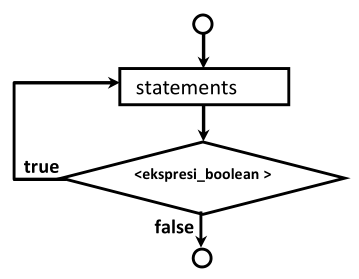

# Tipe Data, Identifier, Operator dan Control Statement

## 2.1 Tipe Data dan Identifier

Program adalah kumpulan instruksi yang disusun sedemikian rupa sehingga mempunyai urutan nalar yang tepat untuk menyelesaikan suatu persoalan. Instruksi-instruksi yang digunakan dalam pemrograman mengacu pada suatu bahasa pemrograman tertentu, pada buku ini menggunakan bahasa pemrograman C++, sehingga penulisan program pada buku ini mengikuti tata bahasa C++.

Segala sesuatu yang diproses oleh program adalah data. Dalam hal ini data adalah elemen-elemen yang digunakan untuk menjelaskan segala sesuatu yang mempunyai besaran (ukuran/ nilai), seperti misalnya **umur** besarannya bisa berupa biangan desimal **42.5** (maksudnya 42½ tahun), **golongan** seorang karyawan besarannya bisa berupa sebuah karakter A (maksudnya goongan A) dan sebagainya. Bahasa C++ menyimpan besaran-besaran tersebut di memori utama untuk dikelola oleh program, sehingga perlu dilakukan pengaturan pemakaian memori, oleh karena itu dalam bahasa pemrograman selalu terdapat istilah-istilah yang bernama **Tipe Data**, **Variabel** dan **Konstanta**.

Identifier (pengenal) adalah suatu nama yang digunakan program untuk merujuk ke suatu lokasi memori tertentu agar nilai pada lokasi tersebut dapat diakses. Alamat lokasi memori sebenarnya berupa angka angka heksadesimal[^heks], namun pada bahasa pemrograman setingkat C++ (middle level programming language) dan di atasnya, telah mengubahnya dalam bentuk identifier (pengenal) yaitu berupa suatu huruf atau kata (label) sehingga kita tidak perlu mengetahu alamat yang sesungguhnya dan dengan identifier (label) akan lebih mudah untuk diingat.

[^heks]:

## 2.2 Tipe Data Bahasa C++

Data yang dapat dikelola oleh program bisa bermacam-macam, seperti misalnya bilangan bulat (*integer*), bilangan dengan desimal (*floating point*), huruf (*character*), dan sebagainya. Oleh sebab itu ketika kita akan memakai suatu lokasi memori tertentu untuk menyimpan nilai diperlukan 2 hal, yaitu `identifier` sebagai pengenal (label) lokasi memori yang digunakan dan `tipe data`, yaitu besaran yang menentukan ukuran memori yang dialokasikan. Sekali suatu identifier sudah dialokasikan dengan tipe data tertentu besarnya ruang yang digunakan tidak bisa diubah. Bahasa C++ mengenal tipe-tipe data berikut ini :

|Tipe Data 				|Ukuran 	|Jangkauan Nilai Yang dapat Ditampung
|-----------------------|-----------|----------------------------------------
|bool 					|1 byte 	|True or false
|unsigned short int 	|2 bytes 	|0 to 65,535
|short int 				|2 bytes 	|–32,768 to 32,767
|unsigned long int 		|4 bytes 	|0 to 4,294,967,295
|long int 				|4 bytes 	|–2,147,483,648 to 2,147,483,647
|int (16 bit) 			|2 bytes 	|–32,768 to 32,767
|int (32 bit) 			|4 bytes 	|–2,147,483,648 to 2,147,483,647
|unsigned int (16 bit) 	|2 bytes 	|0 to 65,535
|unsigned int (32 bit) 	|4 bytes 	|0 to 4,294,967,295
|char 					|1 byte 	|256 character values
|float 					|4 bytes 	|1.2e–38 to 3.4e38
|double 				|8 bytes 	|2.2e–308 to 1.8e308

## 2.3 Variabel dan Konstanta

Nilai yang tersimpan di memori dan dikenal melalui identifier tersebut terdiri dari variabel dan konstanta. Perbedaan diantara keduanya adalah bahwa variabel (sesuai dengan namanya) nilainya dapat diubah-ubah pada saat program dieksekusi, sedangkan konstanta nilainya tidak dapat diubah (`konstan = tetap`).

Sebelum suatu variabel atau konstanta dapat digunakan, tempat pada memori harus dipesan terlebih dahulu, mekanisme ini dinamalan deklarasi. Deklarasi dilakukan dengan cara menuliskan tipe data (ukuran memori yang dibutuhkan) dan diikuti dengan nama pengenal (nama variabel), jika dikehendaki bisa juga suatu variabel langsung diinisialisasi dengan suatu nilai. Pengenal (identifier) bisa terdiri dari sebuah huruf atau kombinasi antara huruf dengan angka dengan syarat.

- Harus diawali dengan huruf
- Tidak boleh memakai karakter khusus kecuali \$ dan garis bawah (\_)
- Tidak boleh sama dengan kata kunci yang digunakan pada C++
- Bersifat case sensitif (huruf besar dan kecil dibedakan)

Walaupun demikian, sebaiknya memberikan nama pengenal variabel sesuai dengan isi dari variabel tersebut, sebab walaupun nama variabel “**c21i8k**” untuk menyimpan nama mahasiswa adalah valid (diperbolehkan), namun akan lebih mudah dimengerti jika identifier yang dipilih adalah “**nama**”.

Konstanta mirip dengan variabel, hanya saja nilainya konstan, tidak dapat diubah-ubah. Untuk dapat membuat konstanta diperlukan inisialisasi ketika konstanta dibuat dan setelah itu nilainya tidak dapat diubah. C++ mempunyai 2 macam konstanta, yaitu konstanta literal dan konstanta simbolik. Berikut ini adalah contoh deklarasi variabel:

```cpp
int harga;
```

Yang dimaksud dengan konstanta literal adalah suatu nilai yang ditulis pada kode program. Sebagai contoh misalnya :

```cpp
int usiaku = 42;
```

Nilai 42 tidak dapat menerima nilai lain dan nilai tersebut bersifat tetap. Perhatikan dalam hal ini identifier “usiaku” adalah variabel (bukan konstanta), yang dinamakan konstanta literal adalah nilai “42” tersebut.

Konstanta simbolik adalah konstanta yang direpresentasikan dengan suatu nama, sama seperti variabel, namun berbeda dengan variabel setelah suatu konstanta diinisialisasi dengan suatu nilai maka nilainya tidak dapat diubah. Ada 2 cara untuk mendeklarasikan konstanta simbolik, yaitu dengan menggunakan preprocessor directive `#define` dan yang kedua adalah dengan memakai kata kunci `const`. Berikut ini contoh mendeklarasikan dan menginisialisasi konstanta :

```cpp
#define kapasitas 15
```

Perhatikan bahwa `kapasitas` tidak mempunyai tipe data tertentu (int, char dsb.). Preprosessor akan melakukan substitusi berupa teks, setiap ada akses terhadap kata `kapasitas`, akan digantikan dengan teks 15. Karena preprosesor bekerja sebelum kompiler, kompiler tidak mengenal konstanta `kapasitas`, yang dikenal hanyalah bilangan 15.


T> ### TIPS
T>
T> Walaupun dengan memakai preprocessor directive `#define` tampak mudah, namun sebaiknya cara ini tidak digunakan, karena sudah dinyatakan usang pada standard C++ .

Cara yang kedua untuk menginisialisasi sebuah konstanta adalah dengan memakai kata kunci const seperti berikut :

```cpp
const int usiaku = 42;
```

Contoh diatas adalah mendeklarasikan konstanta simbolik bernama usiaku bertipe int dan diinisialisasi dengan nilai 42. Setelah baris ini simbol (identifier) bernama usiaku tidak dapat diubah-ubah nilainya. Keuntungan pembuatan konstanta dengan cara ini adalah lebih mudah dipelihara dan mencegah adanya kesalahan dan yang paling penting adalah bahwa konstanta ini mempunyai tipe data dan kompiler dapat mengharuskan konstanta ini diperlakukan sebagai tipe data tersebut.

Contoh 1. Tipe data dan Identifier.


Buka Qt Creator dan buat project Qt Console Application baru dengan nama Contoh 1, kemudian tulis kode berikut.

```cpp
#include <iostream>
int main(int argc, char *argv[])
{
	using namespace std;
	QCoreApplication a(argc, argv);
	
	int panjang, lebar;
	
	panjang = 15; //<-- nilai diubah menjadi 15
	lebar = 12; //<-- nilai diubah menjadi 12
	cout << "Panjang = " << panjang << endl;
	
	cout << "Lebar = " << lebar << endl;
	return a.exec();
}
```

Kemudian jalankan kode diatas dengan menekan tombol Ctrl+R, outputnya adalah sebagai berikut.

A> {linenos=off}
A>	Panjang		=15
A>	lebar		=12

 **Keterangan:**

 - Pada program di atas variabel panjang dan lebar dideklarasikan bertipe int.
 - Kemudian variabel panjang diberi nilai 15 (integer) dan lebar diberi nilai 12 (integer), tampak bahwa nilai dari variabel tersebut dapat diubah.
 - Pada baris berikutnya nilai dari variabel dapat diakses untuk dicetak ke layar.

## 2.4 Statement

Dalam bahasa C++, sebuah statement mengontrol urutan pengerjaan eksekusi, mengevaluasi ekspresi atau tidak mengejakan apapun (*null statement*). Semua statement C++ diakhiri dengan titik koma (;), sebagai contoh misalnya :


	x = a + b;

Pernyataan tersebut bukanlah suatu pernyataan persamaan aljabar dalam matematika yang artinya x sama dengan a + b, melainkan memberi nilai x dengan hasil penjumlahan a dengan b. Pada statement ini terjadi 2 urutan pengerjaan, yaitu pertama menambahkan a dengan b, kemudian yang kedua memberikan hasil perhitungan tersebut ke variabel x dengan operator pengerjaan (=). Walaupun pada pernyataan tersebut terdapat 2 pekerjaan, namun merupakan sebuah statement dan oleh karena itu diakhiri hanya dengan sebuah titik koma (;) saja. Hasil penjumlahan a dengan b ini disebut ekspresi, sedangkan sama dengan (=) dan plus (+) dinamakan operator yang akan dibahas berikut ini.

I> **CATATAN**
I>
I> Operator pengerjaan “=“ akan mengambil nilai apapun yang ada disebelah kanannya kenudian memberikannya kepada apapun yang berada di sebelah kirinya. C++ mengenal juga operator pembanding “==“ yang mempunyai arti berbeda dengan operator sama dengan “=”, akan dibahas lebih detail pada sub bab berikut ini.

## 2.5 Operator dan Ekspresi

Operator adalah suatu simbol yang digunakan untuk melakukan suatu operasi. Operator mempunyai beberapa kategori, antara lain : Aritmatika, Pengerjaan, Hubungan dan Logika. Operator Aritmatika adalah operator yang digunakan untuk melakukan operasi aritmatika seperti misalnya penjumlahan, pengurangan, perkalian dan pembagian. Simbol untuk operator aritmatika ini adalah : +, -, *, / dan %. Berikut ini adalah operator-operator yang dikenal pada bahasa pemrograman C++.

|Kategori 													|Operator 			|Arah Proses 	|Jenjang
|-----------------------------------------------------------|-------------------|---------------|-----
|Kurung, indeks larik dan elemen struktur data 				|() [] . -> 		|Kiri - Kanan 	|1
|Operator Unary 											|! ~ - ++ -- 		|Kanan – Kiri 	|2
|Operator Aritmatika Perkalian, Pembagian dan Sisa Pembagian|* / % 				|Kiri – Kanan 	|3
|Operator aritmatika Pertambahan dan Pengurangan 			|+ - 				|Kiri – Kanan 	|4
|Operator Bitwise Pergeseran Bit 							|<< >> 				|Kiri – Kanan 	|5
|Operator Hubungan 											|< <= > >= 			|Kiri – Kanan 	|6
|Operator Hubungan Kesamaan dan Ketidaksamaan 				|== != 				|Kiri – Kanan 	|7
|Operator Bitwise AND 										|& 					|Kiri – Kanan 	|8
|Operator Bitwise XOR 										|^ 					|Kiri – Kanan 	|9
|Operator Bitwise OR 										|`|`				|Kiri – Kanan 	|10
|Operator Kondisi AND 										|&& 				|Kiri – Kanan 	|11
|Operator Kondisi OR 										| `||` 				|Kiri – Kanan 	|12
|Operator Ternary ? 										| `| `				|Kanan – Kiri 	|13
|Operator Pengerjaan Aritmatika 							|= += -= *= /= %= 	|Kanan – Kiri 	|14
|Operator Pengerjaan Bitwise 								|`&= ^= |= <<= >>=`	|Kanan – Kiri 	|15
|Operator Koma 												|, 					|Kiri – Kanan 	|16

Ekspresi adalah suatu peryataan yang menghasilkan suatu nilai, bisa berasal dari sebuah variabel maupun kumpulan variabel-variabel yang dioperasikan dengan suatu operator, jadi hasil akhir dari suatu ekspresi adalah suatu nilai yang mempunyai besaran dan tipe data tertentu. Pernyataan berikut ini yang disebut ekspresi adalah 15, 12 dan “panjang * lebar” yang menghasilkan nilai 15, 12 dan 180:

```cpp
panjang = 15;
lebar = 12;
luas = panjang * lebar ;
```

 **Keterangan :**

 * Pada baris pertama dan kedua di atas digunakan hanya sebuah operator “`= `“ (yaitu jenjang ke 14), arah proses dari kanan ke kiri, sehingga yang dilakukan :

	* Ekspresi : `15`, diberikan kepada variabel `panjang` (dibaca dari kanan ke kiri).
	
	* Ekspresi : `12`, diberikan kepada variabel `lebar` (dibaca dari kanan ke kiri).

	* Pada baris ketiga terdapat 2 operator, yaitu operator “= “ (jenjang ke 14) dan “`*`” operator “= “ (yaitu jenjang ke 3). Jenjang menunjukkan operator yang akan dikerjakan terlebih dahulu, jika dalam sebuah ungkapan terdapat lebih dari satu jenis operator. Jenjang nomor 1 adalah jenjang yang paling tinggi, maka pada pernyataan di atas yang akan dikerjakan terlebih dahulu adalah orator “`*`” baru kemudian operator “=”, sehingga yang dilakukan:

		- Ekspresi : `panjang * lebar` , berarti `panjang` dikalikan `lebar` (dibaca dari kiri ke kanan), menghasilkan nilai integer `180`.
		- Berikutnya operator “=” mengoperasikan hasil ekspresi tersebut, yaitu nilai integer `180` diberikan kepada variabel `luas` (dibaca dari kanan ke kiri).

T> **TIPS**
T>
T> Operator “(“ dan “)” dapat dipakai untuk merubah jenjang suatu ekspresi menjadi jenjang tertinggi, sehingga akan diproses terlebih dahulu.

### a) Operator Unary

Operator unary adalah operator yang hanya menggunakan sebuah operand saja, operator unary yang dipakai pada kebanyakan bahasa pemrograman adalah operator unary minus (-). Operator unary ditulis sebelum operand, operator unary “-“ berbeda dengan operator aritmatika “-“ yang membutuhkan dua operand. Dalam bahasa C++ disediakan bermacam-macam operator unary.

|Operator 	|Arti
|-----------|---------------------------------------
|- 			|Unary minus
|++ 		|Peningkatan dengan nilai penambahan 1
|-- 		|Penurunan dengan nilai pengurangan 1
|! 			|Unary not
|~ 			|Operator unary komplemen satu (bitwise NOT)

### b) Operator Unary Minus

Operator ini dipakai untuk memberi nilai minus suatu nilai numerik (bukan pengurangan). Misalnya ungkapan : `A + - B * C` akan diartikan `A + (-B) * C`. Operator unary “-“ ditulis di depan operand.

### c) Operator Unary ++ dan --

Operator unary “++“ dan “--“ merupakan operator khusus yang ada di bahasa C. Operator “++“ akan menambahkan nilai 1 ke pengenal yang menggunakannya sedangkan operator “--“ akan mengurangi dengan nilai numerik 1. Operator unary tersebut jika dituliskan sebelum operand disebut _pre increment_ sedangkan jika ditulis setelah operand disebut _post increment_. Perhatikan perbedaannya pada contoh dibawah ini :

|Post Increment 	|Pre Increment
|-------------------|---------------
|x = 5;				|x = 5;
|a = x++;			|a = ++x;
|-------------------|----------------
|**Hasil:**			| **Hasil:**
|x = 6 dan a = 5	|x = 6 dan a = 6


### d) Operator Pengerjaan

Operator pengerjaan atau disebut assignment operator, digunakan untuk menempatkan nilai dari suatu ekspresi ke suatu pengenal. Operator yang umum dipakai pada bahasa pemrograman adalah operator pengerjaan “=”. Selain operator pengerjaan “=”, bahasa C++ menyediakan beberapa operator pengerjaan yang lain seperti tabel di bawah ini.

|Operator 	|Contoh 		|Maksud/ Ekuivalen dengan
|-----------|---------------|---------------------------------
|= 			|a = b + c 		|Mengerjakan b+c ke a
|+= 		|a += 1 		|a = a + 1
|-= 		|a -= b 		|a = a – b
|*= 		|a *= b 		|a = a * b
|/= 		|a /= b 		|a = a / b
|%= 		|a %= b 		|a = a % b

Tabel berikut ini memberikan contoh pemakaian operator-operator di atas, misalnya variabel a dan b bernilai 10.

|Statement 	|Ekuivalen dengan 	|Hasil Ungkapan
|-----------|-------------------|---------------------
|a += 3 	|a = a + 3 			|a = 10 + 3 = 13
|a -= 2 	|a = a - 2 			|a = 10 – 2 = 8
|a *= b/2 	|a = a * (b/2) 		|a = 10 * (10/2) = 50
|a /= b – 8 |a = a / (j – 8) 	|a = 10 / (10-8) = 5

Dari contoh di atas terlihat bahwa operator pengerjaan mempunyai jenjang yang lebih rendah dibanding operator aritmatika, sehingga operator aritmatika dikerjakan terlebih dahulu.

 C++ mengijinkan operator pengerjaan ditulis lebih dari satu kali pada sebuah statement, misalnya :

```cpp
x = y = a * b;
```

Dalam hal ini yang dikerjakan adalah a dikalikan b terlebih dahulu meudian hasilnya diberikan kepada variabel y dan hasil ekspresi y = a * b diberikan kepada variabel x. sehingga misalnya a bernilai 8 dan b bernilai 7, maka baik variabel x maupun y keduanya bernilai 15.

### e) Operator Hubungan

Operator hubungan (*relational operator*) digunakan untuk menunjukkan hubungan antara dua buah operand, hasil dari operator ini adalah True atau False.

|Operator 	|Jenjang|Arti
|-----------|-------|--------------
|< 			|6 		|Lebih kecil dari
|<= 		|6 		|Lebih kecil atau sama dengan
|> 			|6 		|Lebih besar dari
|>= 		|6 		|Lebih besar atau sama dengan
|== 		|7 		|Sama dengan
|!= 		|7 		|Tidak sama dengan


Berikut ini contoh hasil ekspresi jika a bernilai 5, b bernilai 7 dan c bernilai ‘a’

|Ungkapan Hubungan 	|Hasil 	|Nilai
|-------------------|-------|------------------
|a == 5 			|Benar 	|1
|a == b 			|Salah 	|0
|b < 7 				|Salah 	|0
|a <= 7 			|Benar 	|1
|(a+b) != 35 		|Benar 	|1
|c != ‘A’ 			|Benar 	|1
|c <= ‘z’ 			|Benar 	|1

### f) Operator Logika

Jika operator hubungan membandingkan hubungan antara dua buah operand, maka operator logika (*logical operator*) digunakan untuk menggabungkan logika hasil dari operator-operator hubungan. Operator logika menggabungkan __dua buah__ nilai logika. Nilai logika adalah nilai benar (True) atau salah (False).

|Operator	|Jenjang|Arti
|-----------|-------|---------------------
|&& 		|11 	|Logika DAN (AND)
|`||` 		|12 	|Logika ATAU (OR)

Selain dua operator logika ini, operator unary “!” (logika NOT) dapat digunakan untuk operasi logika.

|x		|y 		|x && y |x `||` y 	|!x
|-------|-------|-------|-----------|----------
|TRUE	|TRUE	|TRUE	|TRUE		|FALSE
|TRUE	|FALSE	|FALSE	|TRUE		|FALSE
|FALSE	|TRUE	|FALSE	|TRUE		|TRUE
|FALSE	|FALSE	|FALSE	|FALSE		|TRUE

Contoh : Misalnya A bernilai 5, B bernilai 7 dan C bernilai ‘a’ maka ungkapan dibawah ini mempunyai hasil akhir benar (True).

```cpp
A < B || B == 7 && C > ‘z’
```

Hasil akhir benar (True) dari ekspresi logika tersebut didapat dari langkah-langkah sebagai berikut:

1. Jenjang operator hubungan lebih tinggi dibandingkan dengan operator logika, jadi operator hubungan dikerjakan terlebih dahulu.
2. Operator logika “&&” mempunyai jenjang lebih tinggi dari operator “||”, sehingga operator “&&” dikerjakan terlebih dahulu.
3. Bagian yang paling akhir dikerjakan adalah operator “||”, sehingga hasil akhir logika bernilai logika benar atau True.


## 2.6 Control Statement

Aliran program tidak selalu berjalan secara sekuensial berurutan dari atas ke bawah, kadang-kadang diperlukan **percabangan** atau **perulangan** atau kombinasi dari keduanya. Semua bahasa pemrograman mempunyai struktur kendali (*control statement*) demikian juga bahasa C++. Struktur kendali merupakan pengatur aliran program, mempunyai rangkaian perintah yang harus ditulis untuk memenuhi beberapa keadaan, yaitu:

- Mengulang suatu perintah jika suatu kondisi dipenuhi.
- Melanjutkan sebuah pernyataan bila kondisi terpenuhi.
- Memilih sebuah pilihan dari beberapa alternatif bila kondisi terpenuhi.

###  A. Percabangan

Adalah perintah yang memungkinkan pemilihan atas perintah yang akan dijalankan sesuai dengan kondisi tertentu. Ada tiga macam perintah percabangan dalam C++, yaitu `if`, `if … else`, dan `switch`. Dengan percabangan, suatu baris program akan dikerjakan jika suatu kondisi dipenuhi (benar) atau tidak (else), jadi tidak semua baris program akan dieksekusi.

#### 1. Percabangan dengan if

Sintaks penulisannya sebagai berikut:

```cpp
 if (<ekspresi_boolean>)
 {
 <statements>
 }
```


Flowchart untuk statment ini adalah :


#### 2. Percabangan dengan if .. else

Sintaks penulisannya sebagai berikut :

```cpp
 if (<ekspresi_boolean>)
{
	<dijalankan jika ekspresi_boolean benar>
}
 else
{
	< dijalankan jika ekspresi_boolean salah>
}
```


Flowchart untuk statment ini adalah :

I> **CATATAN**
I>
I> Di dalam `if()` maupun di dalam else bisa diisi dengan perintah
I> `if()` lagi. Bentuk `if()` dalam `if()` ini sering disebut
I> dengan `nested if` (if bersarang).


Flowchart untuk statment if bersarang ini adalah :


#### 3. Percabangan dengan switch

Perintah ini digunakan sebagai alternatif pengganti dari statment `if … else` dengan `else` lebih dari satu. Dengan perintah ini percabangan dapat diarahkan pada beberapa alternatif pilihan berdasarkan nilai ekspresi. Berbeda dengan `if`, `switch` tidak dapat medeteksi *operator pembanding* (>, <, dsb.), karena ekspresi degan operator ini menghasilkan nilai *boolean*, melainkan hanya dapat mengalihkan alur program ke suatu nilai yang sama, pada statement ini ekspresi yang diminta harus menghasilkan bilangan *bulat*.

```cpp
switch (<ekspresi>)
{
case <konst_1>: <pernyataan_1>;
	break;
case <konst_2>: <pernyataan_2>;
	break;
case <konst_n>: <pernyataan_n>;
	break;
default : <pernyataan_default>;
	}
```

Perintah `switch` akan membaca nilai dari `<ekspresi>` kemudian membandingkan hasilnya dengan konstanta-konstanta (`<konst_1>`, `<konst_2>`, `<konst_n>`) yang berada di case. Pembandingan akan dimulai dari `<konst_1>` sampai konstanta `<konst_n>`. Jika hasil dari kondisi sama dengan nilai konstanta tertentu, misalnya `<konst_1>`, maka pernyataan 1 akan dijalankan sampai ditemukan `break`. Pernyataan `break` akan membawa proses keluar dari perintah `switch`. Jika hasil dari kondisi tidak ada yang sama dengan konstanta-konstanta yang diberikan, maka pernyataan pada *default* yang akan dijalankan.


Flowchart untuk statement ini adalah :

Contoh.2 Tipe data dan Identifier.


Buka Qt Creator dan buat project Qt Console Application baru dengan nama Contoh 2, kemudian tulis kode berikut.

```cpp
#include <QtCore/QCoreApplication>
#include <iostream>
int main(int argc, char *argv[])
{
	using namespace std;
	QCoreApplication a(argc, argv);
	
	int hari = 6;
	
	switch(hari){
		case 1 : cout << "Senin" << endl;
		break;
		case 2 : cout << "Selasa" << endl;
		break;
		case 3 : cout << "Rabu" << endl;
		break;
		case 4 : cout << "Kamis" << endl;
		break;
		case 5 : cout << "Jumat" << endl;
		break;
		case 6 : cout << "Sabtu" << endl;
		break;
		case 7 : cout << "Minggu" << endl;
		break;
		default: cout << "Tidak ada..." << endl;
		}
		return a.exec();
}
```

Kemudian jalankan kode diatas dengan menekan tombol Ctrl+R, outputnya adalah sebagai berikut.

A> {linenos=off}
A>	sabtu


**Keterangan Program :**

 - Pada program di atas variabel `hari` dideklarasikan bertipe `int` dan diinisialisasi dengan nilai `6`.
 - Kemudian pada bagian ekspresi di dalam `switch` di isi variabel `hari`, hasil ekspresi tersebut di evaluasi, karena menghasilkan nilai 6, maka yang dicetak ke layar adalah “**Sabtu**”.

### B. Perulangan

Perulangan digunakan untuk mengulang suatu perintah sebanyak yang diinginkan tanpa harus menulis ulang. C++ mengenal tiga jenis perintah perulangan, yaitu `for`, `while` dan `do ..while`.

#### 1. Perulangan dengan for

Digunakan untuk mengulangi perintah dengan jumlah perulangan yang sudah diketahui. Pada statement for ini perlu dituliskan suatu kondisi untuk diuji yang berupa ekspresi boolean, nilai awal dan perintah yang dipakai untuk penghitung (counter). Nilai variabel penghitung akan secara otomatis bertambah atau berkurang tiap kali sebuah perulangan dilaksanakan tergantung perintah yang ditulis pada argumen ini.

Bentuk umum penulisannya sebagai berikut :


```cpp
for(<nilai_awal>; <ekspresi_boolean>; <penambahan/penurunan>)
{
<statmemnts>
}
```


#### 2. Perulangan dengan while

Perintah ini digunakan untuk mengulangi suatu perintah sampai kondisi tertentu. Perulangan akan terus berjalan selama kondisi masih bernilai benar.

Sintaks penulisannya sebagai berikut :


```cpp
for(<nilai_awal>; <ekspresi_boolean>; <penambahan/penurunan>)
{
<statmemnts>
}
```


#### 3. Perulangan dengan do … while

Proses perulangan akan berjalan jika kondisi yang diperiksa di `while` masih bernilai benar dan perulangan akan dihentikan jika kondisinya sudah bernilai salah.

Sintaks penulisannya sebagai berikut :

```cpp
do
{
	<statements>
}
while(<expresi_boolean>)
```




Perbedaan antara perintah `while` dengan `do … while` adalah terletak dari kondisi yang diperiksa. Pada perintah `while`, kondisi yang diperiksa terletak diawal perulangan, sehingga sebelum masuk ke dalam perulangan `while` kondisi harus bernilai benar. Sedangkan pada perintah `do … while`, kondisi diperiksa di akhir perulangan. Ini berarti bahwa paling sedikit sebuah perulangan akan dilakukan oleh perintah `do … while`, karena untuk masuk ke dalam perulangan tidak ada kondisi yang harus dipenuhi.

#### 4. Kata kunci continue dan break

Kata kunci `break` digunakan untuk keluar dari suatu blok programn sebelum ekspresi _boloean_ yang ada pada statement tersebut menghentikan, sedangkan kata kunci `continue` dugunakan untuk mengabaikan baris perintah suatu perintah di bawahnya dan melanjutkan ke perulangan selanjutnya.

Sintaks penulisan `break` dan `continue` adalah sebagai berikut :

```cpp
while(<expresi_boolean1>)
{
	<statements>
if(<expresi_boolean2>)
	continue;
	<statements>
}
```