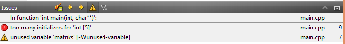
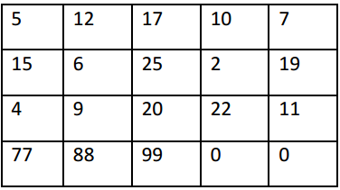

# Array dan String

## 3.1 Array

Array adalah suatu tipe data terstuktur yang berupa sejumlah data sejenis (bertipe data sama) yang jumlahnya tetap dan diberi suatu nama tertentu. Elemen-elemen array tersusun secara sekuensial di dalam memori sehingga memiliki alamat yang berdekatan. Array dapat berupa array 1 dimensi, 2 dimensi, bahkan n-dimensi. Elemen-elemen array bertipe data sama tapi bisa bernilai sama atau berbeda-beda. Array digunakan untuk menyimpan data-data yang diinputkan masing-masing kedalam memory komputer. Jadi jumlah datanya banyak namun satu jenis.

Array dapat digunakan untuk menyimpan data yang cukup banyak namun memiliki tipe yang sama. Bagaimana array melakukan penyimpanan datanya di memory komputer? Ilustrasi array satu dimensi pada memory komputer adalah sebagai berikut:


Array menyimpan data secara berurutan pada memory komputer. Sekali array dideklarasikan (dibuat), maka akan dialokasikan sejumlah tempat di memory komputer yang selalu letaknya berdekatan (bersebelahan). Array memiliki indeks dan nilai data itu sendiri. Sedangkan jarak antar elemen pada array disesuaikan dengan lebar data untuk masing-masing tipe data array. Misalnya pada tipe data integer, maka jarak antar elemennya bernilai 2 s/d 4 byte. Indeks array pada C++ selalu dimulai dari indeks ke 0, dan seterusnya indeks ke-1, 2, 3, dan lain-lain.

### A. Array 1 Dimensi

Elemen-elemen array dapat diakses oleh program menggunakan suatu indeks tertentu. Pengaksesan elemen array dapat dilakukan berurutan atau random berdasarkan indeks tertentu secara langsung. Pengisian dan pengambilan nilai pada indeks tertentu dapat dilakukan dengan mengeset nilai atau menampilkan nilai pada indeks yang dimaksud.

#### 1. Deklarasi Array satu Dimensi

Bentuk umum deklarasi array satu dimensi:


	tipe_data nama_var_array;

**Dimana:**

`tipe_data` 		: menyatakan jenis tipe data elemen larik (int, char, float, dll)

`nama_var_array` 	: menyatakan nama variabel yang dipakai.

`ukuran` 			: menunjukkan jumlah maksimal elemen larik.

Contoh:

```cpp
char huruf[9];
int umur[10];
int kondisi[2] = {0,1};
int arr_dinamis[] = {1,2,3};
```

Artinya:

`char huruf[9]`

: berarti akan memesan tempat di memori komputer sebanyak 9 tempat dengan indeks dari 0-8, dimana semua elemennya bertipe data karakter semuanya. Kalau satu karakter berukuran 1 byte, berarti membutuhkan memori sebesar 9 byte.

`int umur[10]`

: berarti akan memesan tempat di memori komputer sebanyak 10 tempat dengan indeks dari 0-9, dimana semua elemennya bertipe data integer semuanya. Kalau satu integer berukuran 4 bytes, berarti membutuhkan memori sebesar 4 x 10 = 20 bytes.

`int kondisi[2]`

: berarti akan memesan tempat di memori komputer sebanyak 2 tempat dengan indeks 0-1, dimana semua elemennya bertipe data integer semuanya. Dan pada contoh di atas isi elemen-elemennya yang sebanyak 2 buah diisi sekaligus
(diinisialisasi) yaitu pada elemen kondisi[0] bernilai 0, dan elemen kondisi[1] bernilai 1.

`int arr_dinamis[]`

: berarti mendeklarasikan array dengan ukuran maksimum array tidak diketahui, namun ukuran tersebut diketahui berdasarkan inisialisasi yaitu sebanyak 3 elemen, yang isinya 1,2, dan 3. Ingat bahwa array dinamis tidak bisa dibuat tanpa inisialisasi.

Tanda `[]` disebut juga “elemen yang ke- “. Misalnya “`kondisi[0]`“ berarti elemen yang ke nol. Array yang sudah dipesan, misalnya 10 tempat tidak harus diisi semuanya, bisa saja hanya diisi 5 elemen saja, baik secara berurutan maupun tidak. Namun pada kondisi yang tidak sepenuhnya terisi tersebut, tempat pemesanan di memori tetap sebanyak 10 tempat, jadi tempat yang tidak terisi tetap akan terpesan dan dibiarkan kosong.

Contoh 1. Contoh Input dan Output Array

Buatlah project baru dan tulis kode berikut:

```cpp
#include <QtCore/QCoreApplication>
#include <iostream>

using namespace std;

int main(int argc, char *argv[])
{
	QCoreApplication a(argc, argv);
	int nilai[5], x;
	cout<<"Memasukkan nilai"<<endl;
	for(x=0;x<5;x++)
	{
		cout<<"Nilai Angka ke - "<<x+1<< ": ";
		cin>>nilai[x];
		}
		cout<<endl;
		cout<<"Membaca nilai :\n";
		for(x=0;x<5;x++)
		{
			cout<<"Nilai Angka : "<<nilai[x]<<endl;
		}
	return a.exec();
}
```

**Hasil:**

A> {linenos=off}
A>	Memasukan nilai
A>	Nilai Angka ke - 1 : 1
A>	Nilai Angka ke - 2 : 2
A>	Nilai Angka ke - 3 : 3
A>	Nilai Angka ke - 4 : 4
A>	Nilai Angka ke - 5 : 5
A>
A>	Membaca nilai:
A>	Nilai Angka : 1
A>	Nilai Angka : 2
A>	Nilai Angka : 3
A>	Nilai Angka : 4
A>	Nilai Angka : 5


**Keterangan:**
 
 - Pada program diatas, kita membuat sebuah variabel array bernama `nilai` yang berisi `5` elemen bertipe `integer`. Kemudian untuk memasukkan nilai ke masing-masing elemen, digunakan perintah perulangan untuk mengakses indeksnya yang dimulai dari indeks ke `0`. Perulangan dilakukan dari indeks ke `0` sampai dengan indeks ke `4` (dalam hal ini `x < 5`). Mengapa sampai dengan indeks ke `4`? Hal ini karena `5` elemen array yang kita deklarasikan dimulai dari indeks ke `0`. Terdapat `5` elemen array, berarti indeks ke `0`, `1`, `2`, `3`, dan `4`.
 
 - Setelah kita masukkan nilai ke masing-masing elemen, maka kita hanya perlu membaca datanya lagi, yaitu dengan melakukan perulangan kembali dengan cara mengakses indeks elemen-elemennya seperti pada saat kita memasukkan elemen-elemen tersebut kedalam _array_. Perulangan untuk membaca isi elemen array juga diulang dari 0 sampai 4, yang artinya juga 5 elemen. Pada masing-masing perulangan tersebut, ditampilkan isi elemen ke layar dengan perintah `cout<<`.

Contoh 2. Contoh Manipulasi Array

Buatlah project baru dan tulis kode berikut:

```cpp
#include <QtCore/QCoreApplication>
#include <iostream>

using namespace std;

int main(int argc, char *argv[])
{
	QCoreApplication a(argc, argv);
	int bil[7],i;
	cout<<"elemen ke-1 ? "; cin>>bil[0];
	bil[1] = 5;
	bil[2] = bil[1] + 20;
	for(i=4;i<7;i++)
	bil[i] = i*10;
	bil[3] = bil[bil[1]];
	for(i=0;i<7;i++)
	cout<<"bil["<<i<<"] = "<<bil[i]<<" dan alamatnya: "<<&bil[i]<<"\n";
	return a.exec();
}
```
**Hasil:**

A> {linenos=off}
A>	elemen ke-1 ? 1
A>	bil[0] = 1 dan alamatnya: 0x28fe68
A>	bil[1] = 5 dan alamatnya: 0x28fe6c
A>	bil[2] = 25 dan alamatnya: 0x28fe70
A>	bil[3] = 50 dan alamatnya: 0x28fe74
A>	bil[4] = 40 dan alamatnya: 0x28fe78
A>	bil[5] = 50 dan alamatnya: 0x28fe7c
A>	bil[6] = 60 dan alamatnya: 0x28fe80


**Keterangan:**
 
 - Program diatas memasukkan nilai-nilai integer kedalam array bernama bil yang berisi `7` elemen (dari indeks `0-6`).
 - Dalam array satu dimensi, suatu elemen array dapat diisi dengan isi elemen array pada indeks tertentu seperti pada contoh `bil[2] = bil[1] + 20;`. Pada contoh diatas, `bil[2]` diisi dengan `bil[1]` yang berisi `25` ditambah dengan `20`, yaitu `55`.
 - Pada program `bil[3] = bil[bil[1]]`, artinya bilangan elemen ke-3 diisi dengan elemen array yang ke – `bil[1]`. Bilangan elemen ke-1, bernilai 5, yang berarti `bil[3] = bil[5]`. `Bil[5]` bernilai `50`, berarti `bil[3] = 50` juga.
 - Terlihat bahwa jarak antar elemen array `bil` berjarak `4 bytes`.
 - Cara untuk menampilkan alamat *array* adalah dengan menggunakan operator `&`.

T> **TIPS**
T> 
T> Dalam bahasa C++, tidak terdapat *error handling* terhadap batasan nilai indeks, apakah indeks tersebut berada di dalam indeks array yang sudah didefinisikan atau belum. Hal ini merupakan tanggung jawab programmer. Sehingga jika programmer mengakses indeks yang salah, maka nilai yang dihasilkan akan berbeda atau rusak karena mengakses alamat memori yang tidak sesuai.

Contoh 3. Penanganan Batas Indeks Elemen Array

Buatlah program beikut ini:

```cpp
#include <QtCore/QCoreApplication>
#include <iostream>

using namespace std;

int main(int argc, char *argv[])
{
	QCoreApplication a(argc, argv);
	int angka[5];
	angka[0] = 0; //batas bawah array
	angka[4] = 4; //batas atas array
	angka[5] = 5; //indeks melebihi batas
	//program akan HANG
	cout<<angka[5];
	return a.exec();
}
```
**Hasil dan Keterangan:**
 
- Progarm akan HANG-UP. Hal ini terjadi karena compiler tidak bertanggungjawab dengan pengaksesan indeks array yang melebihi batas yang dipesankan di memory.
- Mengapa kompiler tidak menampilkan error pada saat kompilasi? Hal ini karena secara sintaks, program diatas tidaklah memiliki error penulisan. Error yang terjadi pada program diatas adalah runtime error, yaitu error yang terjadi / yang bisa dideteksi saat program sudah berjalan!

### Inisialisasi Array Satu Dimensi

Array satu dimensi dapat diisi secara langsung ditulis pada program. Pengisian data seperti itu sering disebut dengan inisialisasi data array. Cara menginisialisasi data pada array adalah dengan menuliskannya secara langsung pada source code program. Berikut contohnya:

```cpp
// An array of 5 integers, all elements initialized to 0
int IntegerArray[5] = {0};
```
Pada contoh diatas, semua elemen array bertipe integer yang berjumlah 5 buah tersebut diisi dengan nilai 0 semuanya. Cara lain menginisialisasi array satu dimensi adalah sebagai berikut:

```cpp
// An array of 5 integers initialized to zero
int IntegerArray[5] = { 0, 0, 0, 0, 0 };
```

Nah, bagaimana jika kita ingin menginisialisasi elemen terakhirnya saja? Kita tidak bisa melakukannya secara langsung. Yang harus dilakukan adalah dengan menginisialisasinya satu-persatu seperti contoh berikut:


```cpp
// An array of 5 integers initialized to zero
int IntegerArray[5] = { 0, 0, 0, 0, 6 };
```

Pada contoh diatas, elemen terakhir diinilisasi dengan nilai 6. Kita tidak bisa langsung mengisi dengan cara `int IntegerArray[5] = {6}`, karena jika di isi dengan cara demikian, maka isi elemen indeks ke-0 bernilai 6, sedangkan elemen lainnya bernilai 0.

Contoh 4. Inisialisasi Array dengan nilai 0


Buatlah program berikut:

```cpp
#include <QtCore/QCoreApplication>
#include <iostream>

using namespace std;

int main(int argc, char *argv[])
{
	QCoreApplication a(argc, argv);
	int bil[7] = {0}; //inisialisasi 0
	for(int i=0;i<7;i++){
	cout<<"Elemen ke-"<<i<<": "<<bil[i]<<"\n";
	}
	return a.exec();
}
```
**Hasil:**

A> {linenos=off}
A>	Elemen ke-0: 0
A>	Elemen ke-1: 1
A>	Elemen ke-2: 2
A>	Elemen ke-3: 3
A>	Elemen ke-4: 4
A>	Elemen ke-5: 5
A>	Elemen ke-6: 6

**Keterangan**
 
 Pada program diatas elemen array bernama bil yang dipesan sebanyak 7 elemen, di inisialisasi dengan nilai 0. Setelah di inisialisasi dengan nilai 0, maka semua elemen array tersebut juga akan berisi dengan nilai 0. Hal ini dibuktikan dengan cara perulangan semua elemen array dan ditampilkan dengan `cout`.

Contoh 5. Inisialisasi Array dua nilai elemen pertama


Buatlah program berikut ini:

```cpp
#include <QtCore/QCoreApplication>
#include <iostream>

using namespace std;

int main(int argc, char *argv[])
{
	QCoreApplication a(argc, argv);
	int bil[7] = {2,5}; //inisialisasi dua elemen pertama
	for(int i=0;i<7;i++){
		cout<<"Elemen ke-"<<i<<": "<<bil[i]<<"\n";
	}
	return a.exec();
}
```

**Hasil:**

A> {linenos=off}
A>	Elemen ke-0: 2
A>	Elemen ke-1: 5
A>	Elemen ke-2: 0
A>	Elemen ke-3: 0
A>	Elemen ke-4: 0
A>	Elemen ke-5: 0
A>	Elemen ke-6: 0

**Keterangan**
 
Inisialisasi elemen array dapat dilakukan hanya pada dua elemen pertama saja, hal ini dilakukan dengan cara memberikan dua nilai pertama, selanjutnya semua elemen lainnya yang tidak di inisialisasi secara otomatis bernilai 0.

T> **TIPS**
T>
T> Untuk semua array pada C++, inisialisasi satu buah elemen saja pada array akan membuat semua elemen array lainnya berisi nilai 0.

**Contoh:**

```cpp
int angka[100] = {1};
```
 Maka hasilnya adalah:

	angka[0] = 1,
	angka[1] s/d angka[99] = 0

Pada array satu dimensi, kita tidak dapat melakukan inisialisasi pada array melebihi batas jumlah elemen array yang dipesan.

Pada array satu dimensi, kita juga dapat membuat array 1 dimensi tanpa menyebutkan jumlah elemen array yang dipesan. Namun perlu di ingat bahwa semua elemen harus di inisialisai terlebih dahulu.

Contoh:

```cpp
int data[5] = {1,2,3,4,5,6}; //error
int data2[] = {10,20}; //terpesan 2 tempat dimemory
```

Contoh 6. Tanpa inisialisasi, array langsung ditampilkan

Tulislah program berikut ini:

```cpp
#include <QtCore/QCoreApplication>
#include <iostream>

using namespace std;

int main(int argc, char *argv[])
{
	QCoreApplication a(argc, argv);
	char h[5];
	for(int i=0;i<5;i++){
		cout<<"Elemen ke "<<i<<" = "<<h[i]<<endl;
	}
	return a.exec();
}
```

**Hasil:**

A> {linenos=off}
A>	Elemen ke-0: 2
A>	Elemen ke-1: 5
A>	Elemen ke-2: 0
A>	Elemen ke-3: 0
A>	Elemen ke-4: v

**Keterangan**
 
 Pada program C++, elemen array yang sudah dipesan dimemory pasti sudah berisi data. Namun nilai datanya bersifat acak. Sehingga jika kita mendeklarasikan sebuah elemen array tanpa di inisialisasi, maka nilai masing-masing elemen akan bersifat acak juga seperti pada hasil program diatas. Untuk itulah inisialisasi elemen array sangatlah penting.

T> **TIPS**
T>
T> Inisialisasi pada elemen array yang dideklarsikan **SANGATLAH PENTING** untuk menghindari nilai **ACAK**!

Contoh 7. Penggunaan tipe data enum pada Array satu dimensi


Buatlah program berikut:

```cpp
#include <QtCore/QCoreApplication>
#include <iostream>

using namespace std;

int main(int argc, char *argv[])
{
	QCoreApplication a(argc, argv);
	enum Hari { Minggu, Senin, Selasa, Rabu, Kamis, Jumat, Sabtu };
	int ArrayHari[7] = { 10, 20, 30, 40, 50, 60, 70 };
	cout << "Nilai Hari Selasa adalah: " << ArrayHari[Selasa];
	return a.exec();
}
```

**Hasil:**

A> {linenos=off}
A>	Nilai hari selasa adalah = 30

**Keterangan:**
 
Pada program diatas, kita membuat sebuah tipe data enum bernama Hari yang memiliki 7 elemen. Masing-masing elemen `enum` sama saja seperti indeks array yaitu `0-6`. Kemudian kita membuat sebuah array bernama `ArrayHari` yang berisi 7 elemen juga dan berisi nilai `10-70`. Karena kita memanggil `ArrayHari[Selasa]` berarti sama artinya dengan `ArrayHari[2]`. Mengapa 2? Karena indeks Selasa adalah 2. Sehingga muncullah output berupa 30, karena 30 berada pada indeks ke-2 dari `ArrayHari`.
 
 Arti dari program diatas menunjukkan kita dapat mengakses indeks *array* dengan menggunakan `tipe data enum`, karena tipe data `enum` pada kenyataannya akan dikonversikan kedalam nilai `integer`, mulai dari `0`.

### Pengalamatan dan Pengkopian Array 1 Dimensi

Array tidak bisa disalin begitu saja antara array satu yang ada nilainya ke array lain yang kosong. Hal ini dikerenakan array bukanlah tipe data primitif biasa. Array merupakan tipe data referensi dimana data yang berada didalam elemen array berjumlah lebih dari satu buah dan diakses dengan menggunakan alamat memory. Compiler C++ akan mencatat alamat pertama dari indeks pertama array yang kita deklarasikan.

Contoh:

	int data[5] = {1,2,3,4,5};

Maka variabel array data tersebut akan dicatat alamat elemen `data[0]` pada memory. Jika kita mengakses elemen keduanya, yaitu `data[1]`, maka compiler akan melakukan kalkulasi untuk mendapatkan alamat `data[1]`, yaitu dengan cara menambahkan alamat `data[0]` dengan lebar tipe data array yang kita deklarasikan. Pada contoh diatas, kita membuat array bertipe integer. Karena integer berukuran 4 byte, maka jika `data[0]` beralamat di alamat `1000`, maka `data[1]` beralamat di `1000 + 4 = 1004` dan seterusnya.

Lalu bagaimana cara mengkopikan isi elemen array dari satu variabel ke variable array 1 dimensi lainnya? Kita harus menggunakan cara manual, yaitu mengkopikan masing-masing elemennya satu persatu dengan perulangan manual sesuai dengan jumlah elemen array yang dibuat.

Contoh 8. Percobaan Penyalinan Array 1 dimensi

Buatlah program berikut:

```cpp
#include <QtCore/QCoreApplication>
#include <iostream>

using namespace std;

int main(int argc, char *argv[])
{
	QCoreApplication a(argc, argv);
	int A[6]={1,2,3,4,5,6};
	int B[6];
	B = A;
	return a.exec();
}
```

**Hasil:**


**Keterangan:**
 
Program tidak bisa dijalankan karena terdapat **error**, bahwa array tidak bisa dilakukan operasi assigment. Artinya kita tidak bisa mengkopi antar array begitu saja.

Contoh 9. Penyalinan Array 1 dimensi dengan Perulangan

Buatlah program berikut ini:

```cpp
#include <QtCore/QCoreApplication>
#include <iostream>

using namespace std;

int main(int argc, char *argv[])
{
	QCoreApplication a(argc, argv);
	int A[6]={1,2,3,4,5,6};
	int B[6];
	for(int i=0;i<6;i++){
		B[i]=A[i];
	}
	for(int j=0;j<6;j++){
		cout<<B[j]<<endl;
	}
	return a.exec();
}
```
**Hasil:**

A> {linenos=off}
A>	1
A>	2
A>	3
A>	4
A>	5
A>	6

**Keterangan:**
 
 - Cara penyalinan array adalah dengan melakukan perulangan sebanyak elemen array yang akan disalin dan menyalinnya secara manual satu-persatu pada indeks yang sama.
 - Kemudian ditampilkan sesuai dengan indeksnya. Elemen array yang dikopikan masih tetap memiliki array yang asli. Untuk menghapusnya, maka harus dilakukan secara manual.

## Array Multi Dimensi

Array multi dimensi berarti array yang kita deklasaikan dapat dikembangkan ke array dimensi 2 dan seteruanya. Array multi dimensi merupakan topik yang menarik dalam matematika. Setiap dimensi dalam array direpresentasikan sebagai sub bagian dalam array. Oleh karena itu, array dua dimensi array memiliki dua sub bagian, sebuah array tiga-dimensi memiliki tiga sub bagian dan sebagainya. Sebuah contoh bentuk nyata yang baik dari array dua dimensi adalah sebuah papan catur. Satu dimensinya merupakan delapan baris, sedangkan dimensi lainnya merupakan delapan kolom.

Contoh deklarasi array dua dimensi yang menggambarkan papan catur adalah:


	int papan[8][8];

yang digambarkan dalam bentuk:


Array dua dimensi sering kali digambarkan/dianalogikan sebagai sebuah matriks atau bentuk grid. Jika array berdimensi satu hanya terdiri dari 1 baris dan banyak kolom, array berdimensi dua terdiri dari banyak baris dan banyak kolom yang bertipe sama. Ilustrasi array dua dimensi dapat dilihat sebagai berikut.

Berikut adalah gambar array berdimensi (baris x kolom = 3 x 4)


### Deklarasi Array Dua Dimensi

```cpp
tipe_data nama_var_array[batas_baris][batas_kolom];
```

Contoh:

```cpp
int matriks[3][4];
int matriks2[3][4] = { {5,20,1,11}, {4,7,67,-9}, {9,0,45,3} };
```

Array dua dimensi dapat mewakili bentuk suatu matriks, contoh matriks:


selanjutnya dapat dideklarasikan sebagai berikut:


	int x[2][4];

atau diklarasikan dengan langsung menginisialisasi nilai elemen-elemen-nya sebagai berikut:


	int x[2][4]= {{8, 5, 9, 8},{8, 2, 1, 0}}

Selanjutnya larik dua dimensi x dapat digambarkan sebagai berikut:


	x[0][0]=8 x[0][1]=5 x[0][2]=9 x[0][3]=8
	x[1][0]=8 x[1][1]=2 x[1][2]=1 x[1][3]=0

Array dua dimensi dapat digunakan untuk menampung tipe data numerik atau non numerik.

Berikut adalah berbagai bentuk pembuatan array dua dimensi dengan tipe data numerik ataupun non numerik.

Array dua dimensi bertipe data numerik


	int matriks[3][5] = {{5,12,17,10,7},
	{15,6,25,2,19},
	{4,9,20,22,11}};

Jika data array integer yang diinputkan kurang dari deklarasi


	int matriks[3][5] = {{5,12,17,10,7},
	{15,6,25,2,19},
	{4,9 }}; //kurang 3 angka

Maka tiga data yang kurang akan diisi dengan angka 0

Array 2 dimensi dapat juga digunakan untuk menyimpan data karakter (character). Pendeklarasian array 2 dimensi character adalah sebagai berikut:


	char matriks[3][5] = {{’A’,’B’,’C’,’D’,’E’},
	{’F’,’G’,’H’,’I’,’J’},
	{’K’,’L’,’M’,’N’,’O’}};
	char matriks[3][5] = {“ABCDE“,
	“FGHIJ“,
	“KLMNO“};

Akan ditampilkan sebagai:


Array 2 dimensi juga dapat dideklarasikan sebagai berikut:


	char matriks[5][12] = {“Jakarta“,
	“Bandung“,
	“Surabaya“,
	“Semarang“,
	“Yogyakarta“};

Array diatas akan ditampilkan sebagai:


Jika jumlah nilai character lebih banyak daripada deklarasi


	char matriks2[2][2] = {'a','b','c','d','e'};

E> Akan terjadi ERROR!


Jika data array character yang diinputkan kurang dari deklarasi


	char matriks[3][5] = {{‘a’,’b’,’c’,’d’,’e’},
	{‘f’,’g’,’h’,’i’,’j’},
	{‘k’,’l’ }}; //kurang 3 karakter

Maka tiga data yang kurang akan diisi dengan karakter NULL atau ‘\0’

Jika data array integer yang diinputkan lebih dari deklarasi


	int matriks[3][5] = {{5,12,17,10,7},
	{15,6,25,2,19},
	{4,9,20,22,11,14,19 }}; //lebih 2 angka

E> Matriks yang jumlah datanya lebih akan menyebabkan ERROR



Array 2 dimensi juga dapat dideklarasikan secara dinamis. Dinamis bisa dilakukan pada baris array 2 dimensi. Namun kita tidak bisa mendeklarasikan array 2 dimensi secara dinamis pada kolom. Contoh pendeklarasian baris dinamis adalah :


	int matriks[][5] = {{5,12,17,10,7},
	{15,6,25,2,19},
	{4,9,20,22,11}};

Akan ditampilkan sebagai:


Contoh matriks dengan deklarasi baris dinamis lainnya:


	int matriks[][5] = {5,12,17,10,7,
	15,6,25,2,19,
	4,9,20,22,11,77,88,99};

Pada contoh diatas, jika kita hitung jumlah datanya adalah 18 buah, padahal jika kita bagi per lima kolom, maka data 18 akan lebih 3 buah (18/5 = 3). Sehingga secara otomatis terdapat 3 baris dan sisa 3 buah data berikutnya akan membuat baris baru. Array dua dimensi tersebut akan ditampilkan sebagai:



## Pengaksesan Array 2 Dimensi

Pengaksesan elemen-elemen array 2 dimensi dilakukan dengan cara perulangan. Perulangan yang dilakukan harus disesuaikan dengan jumlah dimensinya. Maka array 2 dimensi berarti perulangan yang dilakukan harus dua kali. Terdapat outer loop yang digunakan untuk mengakses baris array 2 dimensi, dan inner loop yang digunakan untuk mengakses kolom array 2 dimensi.

Contoh 10. Deklarasi dan Menampilkan Array 2 Dimensi

Buatlah program berikut:

```cpp
#include <QtCore/QCoreApplication>
#include <iostream>

using namespace std;

int main(int argc, char *argv[])
{
	QCoreApplication a(argc, argv);
	int matriks[3][5] = {{5,12,17,10,7},
	{15,6,25,2,19},
	{4,9,1,5,2}};
	for(int i=0;i<3;i++){
		for(int j=0;j<5;j++){
			cout<<matriks[i][j]<<"\t";
		}
		cout<<endl;
	}
	return a.exec();
}
```

**Hasil:**

A>	5	12	17	10	7
A>	15	6	25	2	19
A>	4	9	1	5	2

**Keterangan:**
 
 Program diatas mendeklarasikan sebuah variabel array 2 dimensi bernama matriks berukuran 3 baris dan 5 kolom. Kemudian matriks tersebut langsung diinisialisasi dengan data integer sejumlah 15 data. Setelah diinisialisasi kemudian dilakukan pengaksesan terhadap array 2 dimensi tersebut dengan cara melakukan dua buah perulangan. Perulangan pertama disebut outer loop yang digunakan untuk mengakses indeks baris variabel matriks, sedangkan perulangan kedua disebut inner loop yang digunakan untuk mengakses indeks kolom variabel matriks. Kemudian untuk menampilkan data nya digunakan perintah cout dan untuk setiap data elemen array diberikan karakter tab yang digunakan untuk memberi jarak antar output data. Karakter tab pada bahasa C menggunakan escape character ‘\t’.

Contoh 11. Penyalinan Array 2 Dimensi ke Array 2 Dimensi lainnya

Misalkan terdapat array 2 dimensi sebagai berikut matriks`[3][5]`


Buatlah program berikut:

```cpp
#include <QtCore/QCoreApplication>
#include <iostream>

using namespace std;

int main(int argc, char *argv[])
{
	QCoreApplication a(argc, argv);
	int matriks[3][5]={{1,2,3,4,5},{6,7,8,9,10},{11,12,13,14,15}};
	int matrikshasil[3][5];
	for(int i=0;i<3;i++){
		for(int j=0;j<5;j++){
			matrikshasil[i][j] = matriks[i][j];
		}
	}
	for(int i=0;i<3;i++){
		for(int j=0;j<5;j++){
			cout<<matrikshasil[i][j]<<"\t";
		}
	cout<<endl;
	}

	return a.exec();
}
```
**Hasil:**


A>	1	2	3	4	5
A>	6	7	8	9	10
A>	11	12	13	14	15

**Keterangan:** 

Program diatas menyalin data dari matriks 2 dimensi ke matriks 2 dimensi lainnya dengan menggunakan perulangan bertingkat. Perulangan bertingkat memiliki 2 buah loop, yang pertama (_outer loop_) digunakan untuk mengakses baris matriks, dan inner loop digunakan untuk mengakses kolom matriks. Kemudian untuk masing-masing elemen matriks dimasukkan kedalam variabel array matrikshasil tepat pada baris dan kolom yang sesuai.

Contoh 12. Penyalinan array 2 dimensi ke dalam array 1 dimensi.

Buatlah program berikut ini:

```cpp
#include <QtCore/QCoreApplication>
#include <iostream>

using namespace std;

int main(int argc, char *argv[])
{
	QCoreApplication a(argc, argv);
	int matriks[3][5]={{1,2,3,4,5},{6,7,8,9,10},{11,12,13,14,15}};
	int matrikshasil[15];
	int counter=-1;
	for(int i=0;i<3;i++){
		for(int j=0;j<5;j++){
			counter++;
			matrikshasil[counter] = matriks[i][j];
		}
	}
	for(int i=0;i<15;i++){
		cout<<matrikshasil[i]<<endl;
	}

	return a.exec();
}
```
**Hasil:**

A> {linenos=off}
A>	1
A>	2
A>	3
A>	4
A>	5
A>	6
A>	7
A>	8
A>	9
A>	10
A>	11
A>	12
A>	13
A>	14
A>	15

**Keterangan:**
 
 - Untuk menyalin array 2 dimensi ke 1 dimensi, maka harus diperlukan sebuah array 1 dimensi baru yang berukuran total sesuai dengan hasil perkalian antara ukuran baris matriks dua dimensi dikalikan kolomnya. Misal array 2 dimensi berukuran 3 x 5, maka harus dibuat array 1 dimensi berukuran minimal 15.
 - Kemudian untuk mengkopikan dari array 2 dimensi matriks ke array 1 dimensi matrikshasil, harus dilakukan perulangan sesuai dengan baris dan kolom matriks. Indeks array matrikshasil diperoleh dari penambahan nilai counter yang diinisialisasi dari -1, dan berjalan mulai dari 0 sampai dengan 14.

### Cara Pengaksesan Array dapat dilakukan dengan 2 cara:

#### 1. Pengaksesan Baris demi Baris

Cara ini menelusuri elemen array dua dimensi per dimulai dari baris pertama lalu kekanan sesuai dengan jumlah kolomnya. Setelah eleman dalam baris tersebut habis, maka penelusuran akan berganti baris ke baris berikutnya dan demikian seterusnya. Cara ini membutuhkan 2 buah loop, dimana outer loop digunakan untuk mengakses indeks baris, dan inner loop digunakan untuk mengakses indeks kolom.

Berikut adalah contohnya:

```cpp
#include <QtCore/QCoreApplication>
#include <iostream>

using namespace std;

int main(int argc, char *argv[])
{
	QCoreApplication a(argc, argv);
	int A[2][3]={{1,2,3},{4,5,6}};
	for(int baris=0;baris<2;baris++){
		for(int kolom=0;kolom<3;kolom++){
			cout<<A[baris][kolom]<<"\t";
		}
	cout<<endl;
	}
	return a.exec();
}
```

**Hasil:**

A> {linenos=off}
A>	1	2	3
A>	4	5	6

#### 2. Pengaksesan Kolom demi Kolom

Cara ini menelusuri elemen array dua dimensi per dimulai dari kolom pertama lalu kebawah sesuai dengan jumlah barisnya. Setelah eleman dalam kolom tersebut habis, maka penelusuran akan berganti kolom ke kolom berikutnya dan demikian seterusnya. Cara ini membutuhkan 2 buah loop, dimana outer loop digunakan untuk mengakses indeks kolom, dan inner loop digunakan untuk mengakses indeks baris.

**Contoh:**

```cpp
#include <QtCore/QCoreApplication>
#include <iostream>

using namespace std;

int main(int argc, char *argv[])
{
	QCoreApplication a(argc, argv);
	int A[2][3]={{1,2,3},{4,5,6}};
	for(int kolom=0;kolom<3;kolom++){
		for(int baris=0;baris<2;baris++){
			cout<<A[baris][kolom]<<"\t";
		}
	cout<<endl;
	}
	return a.exec();
}
```

**Hasil:**

A> {linenos=off}
A>	1	4
A>	2	5
A>	3	6

## String

String adalah kumpulan dari nilai-nilai karakter yang berurutan dalam bentuk satu dimensi, nilai string ini haruslah ditulis didalam tanda petik dua (“) misalnya: “ini string”. Suatu nilai string disimpan di memori dengan diakhiri oleh nilai ‘\0’(null), misalnya nilai string “ANTO” disimpan dimemori dalam bentuk 


Dengan mengetahui nilai string diakhiri oleh nilai ‘\0’, maka akhir nilai dari suatu string dapat dideteksi.

Untuk mendeklarasikan sebuah string terdapat dua cara:

1. Menggunakan array of character yang sering disebut C-style string
2. Menggunakan tipe data string pada C++

### Array of Character

Cara menggunakan array of character sama seperti mendeklarasikan variabel bertipe array namun bertipe data character seperti yang sudah dijelaskan pada bagian-bagian sebelumnya. Array of character memiliki sifat-sifat array lainnya yaitu bersifat statis dan letaknya berurutan di dalam memory komputer. String berjenis array of character selalu dibuat dengan menggunakan array satu dimensi yang dapat terdiri dari karakter-karakter yang ditulis dengan menggunakan tanda petik tunggal (‘) atau satu kesatuan string yang ditulis dengan tanda petik ganda (“).

Contoh pendeklarasian array of character


	char nama[6]; //tanpa inisialisasi
	char nama2[6] = “anton”; //langsung diinisialisasi
	char nama2[6] = {‘a’,’n’,’t’,’o’,’n’}; //langsung diinisialisasi

Pada sebuah string, terdapat karakter `\0` yang dapat digunakan untuk mengetahui kapan berakhirnya suatu string. Berikut adalah contoh penggunaaanya.

Contoh 13. Penggunaan karakter \0


Buatlah program berikut:

```cpp
#include <QtCore/QCoreApplication>
#include <iostream>
using namespace std;
int main(int argc, char *argv[])
{
	QCoreApplication a(argc, argv);
	char string[100]="String";
	int K;
	for(K=0;string[K]!='\0';K++)
	cout<<string[K];
	return a.exec();
}
```
**Hasil:**

A> {linenos=off}
A>	String

**Keterangan:**
 
Program diatas dapat mengetahui kapan berakhirnya suatu string, dalam arti kita dapat mengetahui panjang suatu string dengan melakukan perulangan untuk setiap karakter yang ada pada array sampai ditemukannya katakter ‘\0’.

Contoh 14. String tanpa karakter \0

Buatlah program berikut:

```cpp
#include <QtCore/QCoreApplication>
#include <iostream>
using namespace std;
int main(int argc, char *argv[])
{
	QCoreApplication a(argc, argv);
	char string[6]="String";
	int K;
	for(K=0;string[K]!='\0';K++)
	cout<<string[K];
	return a.exec();
}
```

**Hasil:**


**Keterangan:**
 
Terlihat bahwa kita tidak bisa membuat array fa character tepat sesuai dengan jumlah karakter yang kita inisialisasikan. Jika dilihat kata “String” berjumlah 6 huruf, sedangkan kita sudah mendeklarasikan variabel `string[6]` namun ternyata jumlah elemennya masih dianggap terlalu sedikit. Hal ini terjadi karena minimal kita harus mengalokasikan sejumlah 7 buah elemen. Elemen ke-7 digunakan untuk menyimpan tanda akhir string atau karakter \0 tersebut.

Contoh 15. Mengisi Array of Character

Buatlah program berikut:

```cpp
#include <QtCore/QCoreApplication>
#include <iostream>

using namespace std;

int main(int argc, char *argv[])
{
	QCoreApplication a(argc, argv);
	char buffer[50] = {'\0'};
	cout << "Isi data string: ";
	cin >> buffer;
	cout << "Hasil data string: " << buffer << endl;
	return a.exec();
}
```

**Hasil:**

A> {linenos=off}
A>	Isi data string: Baehaki
A>	hasil data string: Baehaki

**Keterangan:**
 
* Pada program diatas kita mendeklarasikan variabel array of string bernama buffer yang berukuran 6 elemen. Variabel buffer diatas merupakan variabel berjenis string C-style yang diinisialisasi dengan karakter \0 atau karakter NULL.
* Problem lainnya adalah jika kita menginputkan data string yang mengandung spasi, maka cin hanya akan membaca data string sebelum spasi saja.

**Contoh:**


	Isi data string: Ahmad Baehaki
	hasil data string: Ahmad

Contoh 16. Pengisian variabel array of character dengan maksimum jumlah karakter.

Tulislah program berikut:

```cpp
#include <QtCore/QCoreApplication>
#include <iostream>

using namespace std;

int main(int argc, char *argv[])
{
	QCoreApplication a(argc, argv);
	char buffer[50] = {'\0'};
	cout << "Isi data string: ";
	cin.get(buffer,49); //ambil sebanyak 50 karakter atau diakhiri tanda enter
	cout << "Hasil data string: " << buffer << endl;
	return a.exec();
}
```

**Hasil:**

A> {linenos=off}
A>	Isi data string: Ahmad Baehaki
A>	hasil data string: Ahmad Baehaki

**Keterangan:**
 
 Pada contoh program diatas, kita menggunakan perintah `cin.get(buffer,49)`. Perintah diatas “memaksa” agar perintah `cin` mengambil semua data inputan ke dalam variabel buffer sampai sejumlah 49 karakter. Jika karakter yang diinputkan lebih dari 50 karakter, maka otomatis karakter yang disimpan kedalam variabel buffer hanyalah berjumlah 50 karakter pertama saja.

## Fungsi-fungsi String

Bahasa C++ menggunakan fungsi-fungsi pustaka yang disediakan untuk mengoperasikan suatu nilai string yang dimasukkan dalam file header string.h. Beberapa fungsi string yang terdapat pada header string.h adalah sebagai berikut:


	strlen()


Berfungsi untuk menentukkan panjang suatu nilai string.

Bentuk umum: `int strlen(<identifier string>);`


	length()

Berfungsi untuk menentukan panjang suatu nilai tipe data class string

Bentuk umum method: `<nama_var_string>.length();`

Contoh 17. Penggunaan fungsi strlen()


Buatlah program berikut ini:

```cpp
#include <QtCore/QCoreApplication>
#include <iostream>

using namespace std;

int main(int argc, char *argv[])
{
	QCoreApplication a(argc, argv);
	char data[100];
	cout<<"Masukkan kalimat apapun yang anda sukai (max 100 huruf): ";
	cin.get(data,99);
	cout<<"panjang huruf adalah: "<<strlen(data)<<" karakter";
	return a.exec();
}
```

**Hasil:**

A> {linenos=off}
A>	Masukkan kalimat apapun yang anda sukai (max 100 huruf): Nur Wachid
A>	panjang huruf adalah: 10 karakter

**Keterangan:**
 
Fungsi strlen menerima satu parameter yang hanya bertipe array of character. Fungsi ini tidak bisa menerima parameter berupa tipe data C++ string.

Contoh 17. Penggunaan fungsi length pada tipe data string C++

Buatlah program berikut ini:

```cpp
#include <QtCore/QCoreApplication>
#include <iostream>
#include <string>

using namespace std;

int main(int argc, char *argv[])
{
	QCoreApplication a(argc, argv);
	string data2;
	cout<<"Masukkan kalimat apapun yang anda sukai (max 100 huruf): ";
	getline(cin,data2);
	cout<<"panjang huruf adalah: "<<data2.length()<<" karakter";
	return a.exec();
}
```

**Hasil:**

A> {linenos=off}
A>	Masukkan kalimat apapun yang anda sukai (max 100 huruf): Nur Wachid
A>	panjang huruf adalah: 10 karakter

**Keterangan**
 
* Program diatas tidak menggunakan array of character, melainkan menggunakan tipe data C++ `class string`. Tipe data ini spesial karena berupa tipe data object oriented. Untuk menggunakan tipe data ini kita harus menginclude-kan `#include <string>` pada bagian _preprocessor directive_.
* Kemudian untuk mengakses panjang karakternya digunakan method (fungsi) dari object string bernama `length()`. Fungsi `length` sama dengan fungsi `strlen` yaitu mengambil jumlah karakter dalam string tersebut.


#### strcpy() dan strncpy()


Dalam bahasa C++, untuk menyalin nilai suatu string tidak dapat langsung menuliskannya seperti halnya kompiler lain, sehingga proses menyalin atau mengerjakan suatu nilai string ke variabel string yang lain diperlukan suatu fungsi pustaka yang bernama `strcpy()`.

1. Bentuk umum: `void strcpy(<stringhasil>,<stringsumber>);`

2. Bentuk umum: `void strncpy(<stringhasil>,<stringsumber>);`

Contoh 18. Penggunaan fungsi strcpy()

Buatlah program berikut ini:

```cpp
#include <QtCore/QCoreApplication>
#include <iostream>
#include <string>

using namespace std;

int main(int argc, char *argv[])
{
	QCoreApplication a(argc, argv);
	char data[100] = {'\0’};
	char data2[]="STRING";
	strcpy(data,data2);
	cout<<"string pertama: "<<data<<"\n";
	cout<<"string kedua : "<<data2;
	return a.exec();
}
```

**Hasil:**

A> {linenos=off}
A>	String pertama : STRING
A>	String Kedua : STRING

**Keterangan:**
 
* Program diatas digunakan untuk mengkopikan nilai dari array of character data ke data2 dengan menggunakan perintah `strcpy`. Hal itu terbukti dengan hasil akhir dimana string pertama dan kedua bernilai sama, yaitu “STRING”.
* Jika variabel sesumber lebih besar daripada variabel hasil, `trcpy ()` akan error karena melebihi buffer. Untuk melindungi hal ini, digunakan fungsi `strncpy ()` Fungsi ini dapat memberikan parameter jumlah maksimum karakter untuk penyalinan. `strncpy ()` akan menyalin sampai karakter null pertama atau jumlah maksimum.
Contoh Error:
 
 	- `char data[5] = {'\0'};`
 	- `char data2[]="STRING";`
 
* Hal ini terjadi karena data2 berjumlah 6 karakter, sedangkan data berjumlah 5 karakter. Jadi ketika data2 dikopikan ke data, maka akan terjadi error karena tempatnya kurang.

Contoh 19. Penggunaan fungsi strncpy()

Buatlah program beriku:

```cpp
#include <QtCore/QCoreApplication>
#include <iostream>
#include <string>

using namespace std;

int main(int argc, char *argv[])
{
	QCoreApplication a(argc, argv);
	char data[6] = {'\0'};
	char data2[]="STRINGKU";
	strncpy(data,data2,5);
	cout<<"string pertama: "<<data<<"\n";
	cout<<"string kedua : "<<data2;
	return a.exec();
}
```

**Hasil:**

A> {linenos=off}
A>	String pertama : STRING
A>	String Kedua : STRINGKU

**Keterangan:**

* Fungsi `strncpy` dapat digunakan untuk menyalin dari satu array of character ke array of character lainnya dengan memberikan penanda batas maksimal penyalinan. Pada contoh diatas, string “STRINGKU” hendak disalin ke variabel data yang hanya berisi 6 elemen. Karena fungsi `strncpy` hanya dibatasi menyalin 5 karakter saja, maka yang tersalin adalah `STRIN` saja.
* Karakter ke-6 pada variabel data digunakan untuk menyimpan karakter NULL atau \0.

#### strcat()

__Bentuk umum__: `strcat(<string hasil>, <string sumber>);`

String dalam C++ tidak bisa digabungkan begitu saja dengan menggunakan operator + seperti pada bahasa pemrograman Pascal. Jika dipaksakan menggunakan operator + akan ditampilkan pesan kesalahan sebagai berikut ini.

Contoh 20. Penggunaan fungsi strcat()

Buatlah program beriku:

```cpp
#include <QtCore/QCoreApplication>
#include <iostream>
#include <string>

using namespace std;

int main(int argc, char *argv[])

{
	QCoreApplication a(argc, argv);
	char str[6] = "anton";
	char str2[7];
	char str3[14];
	str3 = str + str2;
	return a.exec();
}
```
**Hasil:**


**Keterangan:**
 
Opearator + tidak bisa digunakan untuk menggabungkan dua buah string. Untuk menggabungkan dua string, digunakan fungsi `strcat()`.

Contoh 21. Penggunaan fungsi strcat()

Buatlah program berikut:

```cpp
#include <QtCore/QCoreApplication>
#include <iostream>
#include <string>

using namespace std;

int main(int argc, char *argv[])
{
	QCoreApplication a(argc, argv);
	char string1[100]="Kami kelompok ";
	char string2[]=" belajar Qt C++";
	strcat(string1,string2);
	cout<<"Jadi gabungannya adalah: "<<string1;
	return a.exec();
}
```

**Hasil:**

A> {linenos=off}
A>	Jadi gabungannya adalah: Kami kelompok  belajar Qt C++

**Keterangan:**
 
* Program diatas menggunakan fungsi `strcat` dimana fungsi tersebut akan menggabungkan dua buah string. Parameter string pertama juga digunakan untuk menampung string gabungan kedua string tersebut. Sehingga pada akhirnya variabel string1 lah yang ditampilkan ke layar.
* Variabel `string1` diberi ukuran 100 karena jika tidak diberi ukuran elemen maka `string1` tidak bisa memperbesar ukurannya di memory komputer sehingga akan menyebabkan program **HANG**.


 **TIPS**
 
 Beberapa fungsi yang `#include string.h` dan dapat digunakan untuk memanipulasi _array of character_ adalah:

 _strrev()_
 
 Bentuk umum: `strrev(string)`
 
 Digunakan untuk membalik susunan string, misal: anton menjadi notna
 
 _strlwr()_
 
 Bentuk umum: `strlwr(string)`
 
 Digunakan untuk mengubah string menjadi huruf kecil semua
 
 _strupr_
 
 Bentuk umum: `strupr(string)`
 
 Digunakan untuk mengubah string menjadi huruf besar semua
 
 _strchr()_
 
 Bentuk umum: `strchr(stringsumber,karakter yang dicari)`
 
 Dalam bahasa C++ disediakan suatu fungsi pustaka yaitu `strchr()` untuk mencari nilai suatu karakter yang ada di suatu string. Hasil dari fungsi ini adalah alamat letak dari karakter pertama di nilai string yang sama dengan karakter yang dicari.
 
 _strcmp()_
 
 Bentuk umum: `strcmp(string1,string2);`
 
 Untuk membandingkan dua nilai string tidak bisa menggunakan operator hubungan, karena operator tersebut tidak untuk operasi string. Untuk membandingkan dua nilai string kita gunakan fungsi pustaka `strcmp()` dengan hasil sebagai berikut:
 
 - Hasil < 0, Jika string1 < string2
 - Hasil = 0, Jika string1 = string2
 - Hasil > 0, Jika string1 > string2
 

## Fungsi mengubah string menjadi numerik dan sebaliknya

Pada bahasa C++ tipe data _array of character_ bisa dikonversi menjadi `numerik` dan sebaliknya numerik bisa dikonversi menjadi `array of character`. Caranya adalah `#include <stdlib>`. Fungsi-fungsi konversi dari string ke numerik adalah:


	atoi() //untuk mengubah string menjadi int
	atof() //untuk mengubah string menjadi float
	atol() //untuk mengubah string menjadi long int

Sedangkan kebalikannya, fungsi untuk mengubah numerik menjadi string adalah:


	itoa() //untuk mengubah int menjadi string
	ltoa() //untuk mengubah long int menjadi string
	ultoa() //untuk mengubah unsigned long menjadi string

Fungsi diatas menerima parameter `<var numerik>`, `<var array of character>`, dan `<basis bilangan>`


## Class string pada C++

C++ library standar memiliki kelas string yang membuat bekerja dengan string lebih mudah dengan menyediakan satu set encapsulasi dari data, dan fungsi untuk memanipulasi data string. Kelas ini dikenal dengan `std::` string yang dapat menangani rincian alokasi memori dan membuat kopi string, atau menempatkan mereka di memory dengan lebih mudah.

Contoh 22. Pembuatan variabel string C++, penyalinan string, dan penggabungan string

Buatlah program berikut:

```cpp
#include <QtCore/QCoreApplication>
#include <iostream>
#include <string>
using namespace std;
int main(int argc, char *argv[])
{
	QCoreApplication a(argc, argv);
	string str1("Ini string C++");
	cout<<"Isi str1 = "<<str1<<endl;
	//salin isi str1 ke str2
	string str2;
	str2 = str1;
	cout<<"Isi str2 = "<<str2<<endl;
	//ubah str2
	str2 = "Hallo, ";
	//buat strhasil dan isi dgn gabungan dari str1 dan str2
	string strhasil;
	strhasil = str2 + str1;
	cout<<strhasil;
	return a.exec();
}
```
**Hasil:**

A> {linenos=off}
A>	Isi str1 : Ini string C++
A>	Isi str1 : Ini string C++
A>	Isi str1 : Ini string C++
A>	Halo, Ini string C++

 **Keterangan:**
 
 * Tanpa perlu dipelajari lebih dalam, kita dapat melihat bahwa class string pada C++ jelas jauh lebih cepat penggunaannya dan mudah dalam pembuatan serta penyalinan seperti semudah mengoperasikan variabel bertipe integer saja. Demikian pula, _concatenating_ (penggabungan) dua string dapat dilakukan dengan hanya menambahkan mereka, sama juga seperti kita akan melakukan penjumlahan dengan integer apapun.
 * Syarat untuk dapat menggunakan class string adalah harus mengincludekan `#include <string>`, seperti yang dapat dilihat pada kode program diatas.

T> **TIPS**
T>
T> Class string memiliki beberapa fitur / manfaat, yaitu:
T> 
T> - Mengurangi kesulitan dalam upaya penciptaan dan memanipulasi string
T> - Meningkatkan stabilitas aplikasi yang sedang diprogram dalam pengelolaan dan alokasi memori internal
T> - Mudah dalam menyalin, memotong, menemukan, dan penghapusan string
T> - Memberikan kesempatan pada programmer untuk lebih fokus pada pengembangan aplikasi daripada kesulitan dalam manipulasi string

Contoh 23. Penggunaan class string untuk manipulasi data

Buatlah program berikut:

```cpp
#include <QtCore/QCoreApplication>
#include <iostream>
#include <string>
using namespace std;
int main(int argc, char *argv[])
{
	QCoreApplication a(argc, argv);
	//buat var nama dgn C-style string
	char nama[10] = "Halooooooo";
	//buat var string dan diisi nilai dari var nama
	string nama_copy(nama);
	cout<<nama_copy<<endl;
	//buat var nama2 dan kopikan isinya ke nama2_copy melalui konstruktor
	string nama2 = "saya belajar";
	string nama2_copy(nama2);
	cout<<nama2_copy<<endl;
	//buat var nama35 yg diisi nilai dari nama tapi hanya 5 huruf saja
	string nama35(nama,5);
	cout<<nama35<<endl;
	//buat var ulang yg diisi huruf 'C' sebanyak 10 buah
	string ulang(10,'a');
	cout<<ulang;
	return a.exec();
}
```
**Hasil:**

A> {linenos=off}
A>	Halooooooo
A>	saya belajar
A>	C

**Keterangan:**

 Dapat dilihat langsung pada baris komentar program diatas.

Contoh 24. Penggabungan string dengan menggunakan class string

Buatlah program berikut:

```cpp
#include <QtCore/QCoreApplication>
#include <iostream>
#include <string>
using namespace std;
int main(int argc, char *argv[])
{
	QCoreApplication a(argc, argv);
	string satu("Percobaan 1 ");
	string dua("Percobaan 2 ");
	satu += dua;
	cout<<satu<<endl;
	string tampung = "Percobaan tampung";
	satu.append("Percobaan 3 ");
	satu.append(tampung);
	cout<<satu;
	return a.exec();
}
```
**Hasil:**

A> {linenos=off}
A>	Percobaan 1		Percobaan 2
A>	Percobaan 1		Percobaan 2 	Percobaan 3 	Percebaan tampung

**Keterangan:**

 * Pada program diatas, terdapat dua buah variabel bertipe string, yaitu `satu` dan `dua`. Tipe data string tidak mendukung penggabungan string dengan mudah yaitu dengan menggunakan operator +. Pada contoh diatas, variabel satu ditambah isinya dengan variabel dua dan disimpan kembali pada variabel satu. Sehingga variabel satu berisi string gabungan “Percobaan 1 Percobaan 2”.
 * Kemudian dibuat suatu variabel tampung yang kemudian juga digabungkan kedalam variabel satu. Cara penggabungan (concatenation) string dapat dilakukan juga dengan cara kedua, yaitu dengan menggunakan `method append`. `Method append` ini dimiliki oleh semua variabel bertipe class string dan dapat langsung digunakan dengan memasukkan parameter bertipe string juga.

Contoh 25. Pengaksesan isi nilai class string

Buatlah program berikut:

```cpp
#include <QtCore/QCoreApplication>
#include <iostream>
#include <string>

using namespace std;

int main(int argc, char *argv[])
{
	QCoreApplication a(argc, argv);
	string satu("Indonesia Raya");
	for(size_t i=0;i<satu.length();i++){
		cout<<satu[i]<<endl;
	}
	cout<<endl;
	cout<<"C-sytle: "<<satu.c_str();
	return a.exec();
}
```
**Hasil:**

A> {linenos=off}
A>	I
A>	n
A>	d
A>	o
A>	n
A>	e
A>	s
A>	i
A>	a
A>	 
A>	R
A>	a
A>	y
A>	a
A>	C-style: Indonesia Raya

 **Keterangan:**

 * Variabel string yang bertipe class string juga memiliki sifat yang sama dengan variabel string dengan model C-string style. Keduanya merupakan gabungan dari karakter-karakter yang berbentuk array berdimensi satu. Sehingga jika kita memiliki variabel string satu seperti pada program, kita dapat mengakses semua elemen-elemen karakter penyusun string tersebut dengan menggunakan perulangan dan kemudian kita akses indeks dari masing-masing elemen array characternya.
 * Pada bagian kedua, kita juga bisa mengkonversi dari tipe data class string menjadi tipe data array of character atau tipe data C-style string dengan menggunakan method dari class string, yaitu `c_str()`.

Contoh 26. Menemukan substring pada sebuah string besar

Tulislah program berikut ini:

```cpp
#include <QtCore/QCoreApplication>
#include <iostream>
#include <string>

using namespace std;

int main(int argc, char *argv[])
{
	QCoreApplication a(argc, argv);
	string strSample ("Kata pak Hari, \"hari ini matahari cerah sekali!\"");
	cout << "Contoh string adalah: " << endl;
	cout << strSample << endl << endl;
	// Temukan kata "hari"
	size_t nOffset = strSample.find ("hari", 0);
	// Cek apakah ketemu?
	if (nOffset != string::npos)
	cout << "Ketemu pertama kata \"hari\" pada offset " << nOffset;
	else
	cout << "Substring tidak ditemukan" << endl;
	cout << endl << endl;
	cout << "Mencari semua kata substring \"hari\"" << endl;
	size_t nSubstringOffset = strSample.find ("hari", 0);
	while (nSubstringOffset != string::npos)
	{
	cout << "Kata \"hari\" ada di offset " << nSubstringOffset << endl;
	// Pencarian dilanjutkan ke karakter berikutnya dst
	size_t nSearchOffset = nSubstringOffset + 1;
	nSubstringOffset = strSample.find ("hari", nSearchOffset);
	}
	cout << endl;
	cout << "Mencari semua karakter 'a'" << endl;
	const char chCharToSearch = 'a';
	size_t nCharacterOffset = strSample.find (chCharToSearch, 0);
	while (nCharacterOffset != string::npos)
	{
	cout << "'" << chCharToSearch << "' ditemukan";
	cout << " pada posisi " << nCharacterOffset << endl;
	//pencarian dilanjutkan
	size_t nCharSearchOffset = nCharacterOffset + 1;
	nCharacterOffset = strSample.find(chCharToSearch,nCharSearchOffset);
	}
	return a.exec();
}
```
**Hasil:**

A> {linenos=off}
A>	Contoh string adalah: 
A>	Kata pak Hari, "hari ini matahari cerah sekali!"
A>
A>	Ketemu pertama kata "hari" pada offset 16
A>
A>	Mencari semua kata substring "hari"
A>	Kata "hari" ada di offset 16
A>	Kata "hari" ada di offset 29
A>
A>	Mencari semua karakter 'a'
A>	'a' ditemukan pada posisi 1
A>	'a' ditemukan pada posisi 3
A>	'a' ditemukan pada posisi 6
A>	'a' ditemukan pada posisi 10
A>	'a' ditemukan pada posisi 17
A>	'a' ditemukan pada posisi 26
A>	'a' ditemukan pada posisi 28
A>	'a' ditemukan pada posisi 30
A>	'a' ditemukan pada posisi 37
A>	'a' ditemukan pada posisi 43

**Keterangan:**
 
* Program diatas membuat sebuah variabel string bernama strSample yang diisi dengan kalimat : “Kata pak Hari, “hari ini matahari cerah sekali!””. Kemudian program akan mencari kata “hari” yang pertama ditemukan pada kalimat tersebut dengan menggunakan method find(`<kata yang dicari>`,`<posisi indeks dimulainya pencarian>`). Method ini bersifat case-sensitive sehingga kata “Hari” dengan “hari” berbeda. Pencarian dimulai dari huruf pertama, sehingga kata “hari” ditemukan pada huruf ke 16, bukan ke-9, karena karakter ke-9 kata “Hari” menggunakan huruf
besar.
* Pencarian berikutnya adalah pencarian semua kata “hari”. Karena kata “hari” ada lebih dari satu buah, maka pencarian harus diloop, karena method find membutuhkan indeks mulainya pencarian. Untuk setiap kata “hari” yang ditemukan, kemudian ditampilkan posisi indeksnya ke
layar.
* Selain dapat menerima parameter berupa substring, method find juga dapat menerima parameter berupa character dengan proses pencarian yang sama dengan proses pencarian dengan parameter substring.

Contoh 27. Membalik kata / kalimat.

Tulislah program berikut ini:

```cpp
#include <QtCore/QCoreApplication>
#include <iostream>
#include <string>
#include <algorithm>

using namespace std;

int main(int argc, char *argv[])
{
	QCoreApplication a(argc, argv);
	string strSample ("String ini akan dibalik!");
	cout << "String asli: " << endl;
	cout << strSample << endl << endl;
	reverse (strSample.begin (), strSample.end ());
	cout << "Setelah dibalik: " << endl;
	cout << strSample;
	return a.exec();
}
```

**Hasil:**

A> {linenos=off}
A>	String asli: 
A>	String ini akan dibalik!
A>
A>	Setelah dibalik:
A>	!kilabid naka ini gnirtS

**Keterangan:**
 
Untuk membalik kalimat bertipe string, kita harus menggunakan library header algoritm, sehingga kita harus mengincludekan library tersebut `#include <algorithm>`. Setelah itu untuk menggunakannya kita gunakan perintah *reverse*(`<indeks string pertam>`,`<indeks string terakhir>`). Perintah reverse tersebut akan benar-benar mengganti string asli menjadi terbalik, sehingga variable string kita akan berubah berisi kalimat yang sudah terbalik.

Contoh 28. Konversi huruf besar dan kecil.

Tulislah program berikut ini:

```cpp
#include <QtCore/QCoreApplication>
#include <iostream>
#include <string>
#include <algorithm>
using namespace std;
int main(int argc, char *argv[])
{
	QCoreApplication a(argc, argv);
	cout << "Masukkan sebuah string: " << endl;
	string strInput;
	getline (cin, strInput);
	transform(strInput.begin(),strInput.end(),strInput.begin(),(int(*)(int))toupper);
	cout << "Hasil konversi ke huruf besar: " << endl;
	cout << strInput << endl << endl;
	transform
	(strInput.begin(),strInput.end(),strInput.begin(),(int(*)(int))tolower);
	cout << "Hasil konversi ke huruf kecil: " << endl;
	cout << strInput << endl << endl;
	return a.exec();
}
```

**Hasil:**

A> {linenos=off}
A>	Masukkan sebuah string:
A>	Ini KoK tulisaNya AlaY BaNGet yA!
A>	Hasil konversi ke huruf besar:
A>	INI KOK TULISANYA ALAY BANGET YA!
A>
A>	Hasil konversi ke huruf kecil:
A>	ini kok tulisanya alay banget ya!

 **Keterangan:**
 
 Program diatas menunjukkan function transform pada library algoritm dapat digunakan untuk mengkonversi string dari besar ke kecil dan dari kecil ke besar.