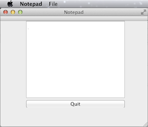
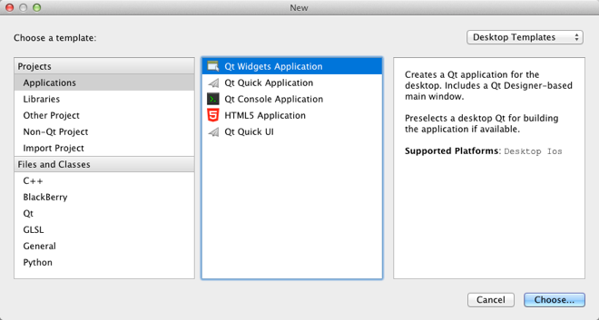
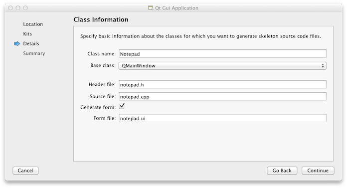
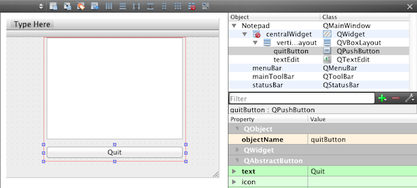
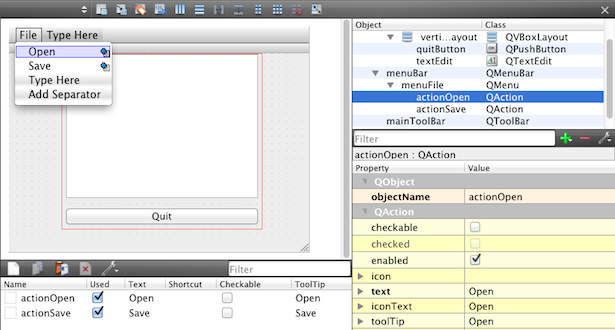
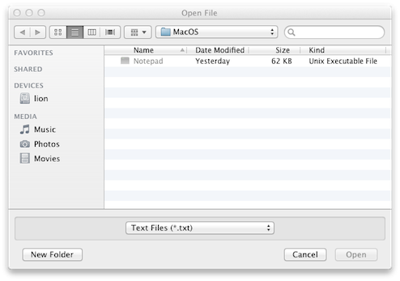
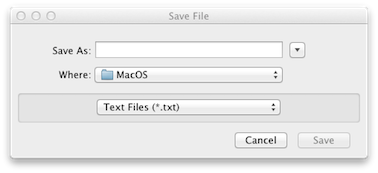

Getting Started Programming with Qt Widgets
============================================

In this topic, we teach basic Qt knowledge by implementing a simple
Notepad application using C++ and the [Qt Widgets](qtwidgets-index.html)
module. We use the Qt Creator IDE and Qt Designer to generate some code,
but you could also write all the code yourself.

After reading this topic, you are ready to refer to our overviews and
API documentation, to find the information you need for the application
you are developing.

In this topic, we first use Qt Creator to create a project with the
necessary files. Then we use Qt Designer to modify the user interface
files to show a text edit and a push button in a window on the desktop.
This represents a simple Qt application that has a GUI. Finally, we add
user interaction to the application by creating actions for opening and
saving files.



You can find the final Notepad source files in the qtdoc repository in
the snippets/widgets-tutorial/notepad directory. You can either fetch
the Qt 5 sources from Qt Project or install them as part of Qt 5.

[]()
Creating the Notepad Project
----------------------------

Setting up a new project in Qt Creator is aided by a wizard that guides
you step-by-step through the project creation process. The wizard
prompts you to enter the settings needed for that particular type of
project and creates the project for you.



To create the Notepad project, select **File** &gt; **New File or
Project** &gt; **Applications** &gt; **Qt Widgets Application** &gt;
**Choose**, and follow the instructions of the wizard. In the **Class
Information** dialog, type **Notepad** as the class name and select
**QMainWindow** as the base class.



The **Qt Widgets Application** wizard creates a project that contains a
main source file and a set of files that specify a user interface
(Notepad widget):

-   notepad.pro - the project file.
-   main.cpp - the main source file for the application.
-   notepad.cpp - the source file of the notepad class of the
    Notepad widget.
-   notepad.h - the header file of the notepad class for the
    Notepad widget.
-   notepad.ui - the UI form for the Notepad widget.

The .cpp, .h, and .ui files come with the necessary boiler plate code
for you to be able to build and run the project. The .pro file is
complete. We will take a closer look at the file contents in the
following sections.

**Learn More**

<div class="table">

  About                                                 Here
  ----------------------------------------------------- ---------------------------------------------------------------------------
  Using Qt Creator                                      [Qt Creator](http://doc.qt.io/qtcreator/index.html)
  Creating other kind of applications with Qt Creator   [Qt Creator Tutorials](http://doc.qt.io/qtcreator/creator-tutorials.html)

</div>

[]()
Main Source File
----------------

The wizard generates the following code in the main.cpp file:

``` {.cpp}
#include "notepad.h"
#include <QApplication>

int main(int argc, char *argv[])
{
    QApplication a(argc, argv);
    Notepad w;
    w.show();

    return a.exec();
}
```

Let us go through the code line by line. The following lines include the
header files for the Notepad widget and
[QApplication](qapplication.html). All Qt classes have a header file
named after them.

``` {.cpp}
#include "notepad.h"
#include <QApplication>
```

The following line defines the main function that is the entry point for
all C and C++ based applications:

``` {.cpp}
int main(int argc, char *argv[])
{
```

The following line creates a [QApplication](qapplication.html) object.
This object manages application-wide resources and is necessary to run
any Qt program that uses Qt Widgets. It constructs an application object
with `argc` command line arguments run in `argv`. (For GUI applications
that do not use Qt Widgets, you can use
[QGuiApplication](qguiapplication.html) instead.)

``` {.cpp}
    QApplication a(argc, argv);
```

The following line creates the Notepad object. This is the object for
which the wizard created the class and the UI file. The user interface
contains visual elements that are called `widgets` in Qt. Examples of
widgets are text edits, scroll bars, labels, and radio buttons. A widget
can also be a container for other widgets; a dialog or a main
application window, for example.

``` {.cpp}
    Notepad w;
```

The following line shows the Notepad widget on the screen in its own
window. Since widgets also function as containers (for instance a
[QMainWindow](qmainwindow.html), which has toolbars, menus, a status
bar, and a few other widgets), it is possible to show a single widget in
its own window. Widgets are not visible by default; the function
[show()](qwidget.html#show) makes the widget visible.

``` {.cpp}
    w.show();
```

The following line makes the [QApplication](qapplication.html) enter its
event loop. When a Qt application is running, events are generated and
sent to the widgets of the application. Examples of events are mouse
presses and key strokes.

``` {.cpp}
    return a.exec();
```

**Learn More**

<div class="table">

  About                         Here
  ----------------------------- -------------------------------------------------------
  Widgets and Window Geometry   [Window and Dialog Widgets](application-windows.html)
  Events and event handling     [The Event System](eventsandfilters.html)

</div>

[]()
Designing a UI
--------------

The wizard generates a user interface definition in XML format,
notepad.ui. When you open the notepad.ui file in Qt Creator, it
automatically opens in the integrated Qt Designer.

When you build the application, Qt Creator launches the Qt [User
Interface Compiler (uic)](uic.html) that reads the .ui file and creates
a corresponding C++ header file, ui\_notepad.h.

[]()
### Using Qt Designer

The wizard creates an application that uses a
[QMainWindow](qmainwindow.html). It has its own layout to which you can
add a menu bar, dock widgets, tool bars, and a status bar. The center
area can be occupied by any kind of widget. The wizard places the
Notepad widget there.

Let us use Qt Designer to add a [QTextEdit](qtextedit.html) object and a
[QPushButton](qpushbutton.html) object to the main window. When you type
text in the text edit widget, it receives key pressed events and
responds by drawing the text typed. The button will exit the Notepad
application when pushed (that is, clicked with the mouse).

To add widgets in Qt Designer:

1.  In the Qt Creator **Editor** mode, double-click the notepad.ui file
    in the **Projects** view to launch the file in the integrated
    Qt Designer.
2.  Drag and drop the following widgets to the form:
    -   Text Edit ([QTextEdit](qtextedit.html))
    -   Push Button ([QPushButton](qpushbutton.html))

3.  Double-click the **Push Button** widget and enter the text **Quit**.
4.  In the **Properties** pane, change the value of **objectName** to
    **quitButton**.
5.  Press **Ctrl+A** (or **Cmd+A**) to select the widgets and click
    **Lay out Vertically** (or press **Ctrl+L**) to apply a vertical
    layout ([QVBoxLayout](qvboxlayout.html)).
6.  Press **Ctrl+S** (or **Cmd+S**) to save your changes.

The UI now looks as follows in Qt Designer:



You can view the generated XML file in the code editor:

``` {.qml}
<?xml version="1.0" encoding="UTF-8"?>
<ui version="4.0">
 <class>Notepad</class>
 <widget class="QMainWindow" name="Notepad">
  <property name="geometry">
   <rect>
    <x>0</x>
    <y>0</y>
    <width>400</width>
    <height>300</height>
   </rect>
  </property>
  <property name="windowTitle">
   <string>Notepad</string>
  </property>
  <widget class="QWidget" name="centralWidget">
   <widget class="QWidget" name="">
    <property name="geometry">
     <rect>
      <x>70</x>
      <y>0</y>
      <width>268</width>
      <height>235</height>
     </rect>
    </property>
    <layout class="QVBoxLayout" name="verticalLayout">
     <item>
      <widget class="QTextEdit" name="textEdit"/>
     </item>
     <item>
      <widget class="QPushButton" name="quitButton">
       <property name="text">
        <string>Quit</string>
       </property>
      </widget>
     </item>
    </layout>
   </widget>
  </widget>
  <widget class="QMenuBar" name="menuBar">
    ...
```

The following line contains the XML declaration, which specifies the XML
version and character encoding used in the document:

``` {.cpp}
<?xml version="1.0" encoding="UTF-8"?>
```

The rest of the file specifies an `ui` element that defines a Notepad
widget:

``` {.cpp}
<ui version="4.0">
```

The following snippet creates a [QVBoxLayout](qvboxlayout.html) widget
that contains a [QTextEdit](qtextedit.html) and
[QPushButton](qpushbutton.html) widget. As mentioned, widgets can
contain other widgets. It is possible to set the bounds (the location
and size) of child widgets directly, but it is usually easier to use a
layout. A layout manages the bounds of a widget's children.
[QVBoxLayout](qvboxlayout.html), for instance, places the children in a
vertical row.

``` {.cpp}
<layout class="QVBoxLayout" name="verticalLayout">
 <item>
  <widget class="QTextEdit" name="textEdit"/>
 </item>
 <item>
  <widget class="QPushButton" name="quitButton">
   <property name="text">
    <string>Quit</string>
   </property>
  </widget>
 </item>
</layout>
```

The UI file is used together with the header and source file of the
Notepad class. We will look at the rest of the UI file in the later
sections.

[]()
### Notepad Header File

The wizard generated a header file for the Notepad class that has the
necessary \#includes, a constructor, a destructor, and the Ui object.
The file looks as follows:

``` {.cpp}
#include <QMainWindow>

namespace Ui {
class Notepad;
}

class Notepad : public QMainWindow
{
    Q_OBJECT

public:
    explicit Notepad(QWidget *parent = 0);
    ~Notepad();

private:
    Ui::Notepad *ui;
};
```

The following line includes [QMainWindow](qmainwindow.html) that
provides a main application window:

``` {.cpp}
#include <QMainWindow>
```

The following lines declare the Notepad class in the Ui namespace, which
is the standard namespace for the UI classes generated from .ui files by
the `uic` tool:

``` {.cpp}
namespace Ui {
class Notepad;
}
```

The class declaration contains the `Q_OBJECT` macro. It must come first
in the class definition, and declares our class as a
[QObject](qobject.html). Naturally, it must also inherit from
[QObject](qobject.html). A [QObject](qobject.html) adds several
abilities to a normal C++ class. Notably, the class name and slot names
can be queried at run-time. It is also possible to query a slot's
parameter types and invoke it.

``` {.cpp}
class Notepad : public QMainWindow
{
    Q_OBJECT
```

The following lines declare a constructor that has a default argument
called `parent`. The value 0 indicates that the widget has no parent (it
is a top-level widget).

``` {.cpp}
public:
    explicit Notepad(QWidget *parent = 0);
```

The following line declares a virtual destructor to free the resources
that were acquired by the object during its life-cycle. According to the
C++ naming convention, destructors have the same name as the class they
are associated with, prefixed with a tilde (\~). In
[QObject](qobject.html), destructors are virtual to ensure that the
destructors of derived classes are invoked properly when an object is
deleted through a pointer-to-base-class.

``` {.cpp}
    ~Notepad();
```

The following lines declare a member variable which is a pointer to the
Notepad UI class. A member variable is associated with a specific class,
and accessible for all its methods.

``` {.cpp}
private:
    Ui::Notepad *ui;
```

[]()
### Notepad Source File

The source file that the wizard generated for the Notepad class looks as
follows:

``` {.cpp}
#include "notepad.h"
#include "ui_notepad.h"

Notepad::Notepad(QWidget *parent) :
    QMainWindow(parent),
    ui(new Ui::Notepad)
{

    ui->setupUi(this);
}

Notepad::~Notepad()
{
    delete ui;
}
```

The following lines include the Notepad class header file that was
generated by the wizard and the UI header file that was generated by the
`uic` tool:

``` {.cpp}
#include "notepad.h"
#include "ui_notepad.h"
```

The following line defines the `Notepad` constructor:

``` {.cpp}
Notepad::Notepad(QWidget *parent) :
```

The following line calls the [QMainWindow](qmainwindow.html)
constructor, which is the base class for the Notepad class:

``` {.cpp}
    QMainWindow(parent),
```

The following line creates the UI class instance and assigns it to the
`ui` member:

``` {.cpp}
    ui(new Ui::Notepad)
```

The following line sets up the UI:

``` {.cpp}
    ui->setupUi(this);
```

In the destructor, we delete the `ui`:

``` {.cpp}
Notepad::~Notepad()
{
    delete ui;
}
```

[]()
### Project File

The wizard generates the following project file, `notepad.pro`, for us:

``` {.cpp}
QT       += core gui

greaterThan(QT_MAJOR_VERSION, 4): QT += widgets

TARGET = Notepad
TEMPLATE = app

SOURCES += main.cpp\
        notepad.cpp

HEADERS  += notepad.h

FORMS    += notepad.ui
```

The project file specifies the application name and the `qmake` template
to use for generating the project, as well as the source, header, and UI
files included in the project.

You could also use `qmake`'s `-project` option to generate the .pro
file. Although, in that case, you have to remember to add the line
`QT += widgets` to the generated file in order to link against the Qt
Widgets Module.

**Learn More**

<div class="table">

  About                                                                   Here
  ----------------------------------------------------------------------- ------------------------------------------------------------------------------------------------------------------------------------------
  Using Qt Designer                                                       [Qt Designer Manual](qtdesigner-manual.html)
  Layouts                                                                 [Layout Management](layout.html), [Widgets and Layouts](graphicsview.html#widgets-and-layouts), [Layout Examples](examples-layouts.html)
  The widgets that come with Qt                                           [Qt Widget Gallery](gallery.html)
  Main windows and main window classes                                    [Application Main Window](mainwindow.html), [Main Window Examples](examples-mainwindow.html)
  QObjects and the Qt Object model (This is essential to understand Qt)   [Object Model](object.html)
  qmake and the Qt build system                                           [qmake Manual](qmake-manual.html)

</div>

[]()
Adding User Interaction
-----------------------

We now have a user interface, but it does not really do anything useful,
as it only contains a text edit and a push button, as well as some
standard functions for quitting, minimizing and maximizing the
application. To make the application useful, we will add user
interaction to it. First, we will add functionality to the push button.
Second, we will add functions for loading a file to the text edit and
for saving the contents of the text edit as a file.

[]()
### Adding Push Buttons

Most desktop operating systems have standard ways of enabling users to
quit applications. However, in this example we use this basic function
to illustrate how you can add user interaction to applications. To do
this, we add a slot that we connect to the **Quit button**.

To exit the application when the **Quit** button is pushed, you use the
Qt signals and slots mechanism. A signal is emitted when a particular
event occurs and a slot is a function that is called in response to a
particular signal. Qt widgets have predefined signals and slots that you
can use directly from Qt Designer.

To use Qt Designer to add a slot for the quit function, right-click the
**Quit** button to open a context-menu and then select **Go to slot**
&gt; **clicked()**.

A private slot, `on_quitButton_clicked()`, is added to the Notepad
widget class header file, notepad.h and a private function,
`Notepad::on_quitButton_clicked()`, is added to the Notepad widget class
source file, notepad.cpp. We just need to write the code to execute the
quit function in the source file.

Let us look at the modified code in the header file, notepad.h:

``` {.cpp}
namespace Ui {
class Notepad;
}

class Notepad : public QMainWindow
{
    Q_OBJECT

public:
    explicit Notepad(QWidget *parent = 0);
    ~Notepad();

private slots:
    void on_quitButton_clicked();

private:
    Ui::Notepad *ui;
};
```

The following code uses Qt's signals and slots mechanism to make the
application exit when the **Quit button** is pushed. Qt Designer uses
[QMetaObject](qmetaobject.html) [auto-connection
facilities](designer-using-a-ui-file.html#automatic-connections) to
connect the button's clicked() signal to a slot in the Notepad class.
The `uic` tool automatically generates code in the dialog's `setupUi()`
function to do this, so Qt Designer only needs to declare and implement
a slot with a name that follows a standard convention.

``` {.cpp}
private slots:
    void on_quitButton_clicked();
```

The corresponding code in the source file, notepad.cpp, looks as
follows:

``` {.cpp}
void Notepad::on_quitButton_clicked()
{

}
```

The code defines the private function that is executed when
[QPushButton](qpushbutton.html) emits the
[clicked()](qabstractbutton.html#clicked) signal.

We now complement the code to have the
[quit()](qcoreapplication.html#quit) slot of
[QApplication](qapplication.html) exit Notepad:

``` {.cpp}
void Notepad::on_quitButton_clicked()
{
    qApp->quit();
}
```

**Learn More**

<div class="table">

  About               Here
  ------------------- -----------------------------------------
  Signals and slots   [Signals & Slots](signalsandslots.html)

</div>

[]()
### Adding Menu Items

Often, in a main window, the same slot should be invoked by several
widgets. Examples are menu items and buttons on a tool bar. To make this
easier, Qt provides [QAction](qaction.html), which can be given to
several widgets, and be connected to a slot. For instance, both
[QMenu](qmenu.html) and [QToolBar](qtoolbar.html) can create menu items
and tool buttons from the same [QAction](qaction.html).

To learn how to use actions with signals and slots, we add menu items to
open and save a document and connect them to slots.

As before, we use Qt Designer to add the widgets to the user interface.
The wizard creates an application with a [QMenu](qmenu.html) widget,
with the text **Type Here** as a placeholder for menu and menu item
names. Double-click the text to enter names for the **File** menu and
**Open** and **Save** menu items. Qt Designer automatically generates
the appropriate actions.



To connect the actions to slots, right-click an action and select **Go
to slot** &gt; **triggered()**.

[QAction](qaction.html) instances are created with the text that should
appear on the widgets that we add them to (in our case, menu items). If
we also wanted to add the actions to a tool bar, we could have specified
[icons](qicon.html) for them.

The modified code in notepad.ui now looks as follows:

``` {.qml}
  <widget class="QMenuBar" name="menuBar">
   <property name="geometry">
    <rect>
     <x>0</x>
     <y>0</y>
     <width>400</width>
     <height>22</height>
    </rect>
   </property>
   <widget class="QMenu" name="menuFile">
    <property name="title">
     <string>File</string>
    </property>
    <addaction name="actionOpen"/>
    <addaction name="actionSave"/>
   </widget>
   <addaction name="menuFile"/>
  </widget>
  <widget class="QToolBar" name="mainToolBar">
   <attribute name="toolBarArea">
    <enum>TopToolBarArea</enum>
   </attribute>
   <attribute name="toolBarBreak">
    <bool>false</bool>
   </attribute>
  </widget>
  <widget class="QStatusBar" name="statusBar"/>
  <action name="actionOpen">
   <property name="text">
    <string>Open</string>
   </property>
  </action>
  <action name="actionSave">
   <property name="text">
    <string>Save</string>
   </property>
  </action>
 </widget>
```

Qt Designer adds the private slots `on_actionOpen_triggered()` and
`on_actionSave_triggered()` to notepad.h and the private functions
`Notepad::on_actionOpen_triggered()` and
`Notepad::on_actionSave_triggered()` to notepad.cpp.

In the following sections, we complement the code to load and save
files. When a menu item is clicked, the item triggers the action, and
the respective slot is invoked.

[]()
### Opening Files

In this section, we implement the functionality of the
`on_actionOpen_triggered()` slot. The first step is asking the user for
the name of the file to open. Qt comes with
[QFileDialog](qfiledialog.html), which is a dialog from which the user
can select a file. The appearance of the dialog depends on the desktop
platform that you run the application on. The following image shows the
dialog on OS X:



We complement the code generated by Qt Designer in notepad.cpp, as
follows:

``` {.cpp}
void Notepad::on_actionOpen_triggered()
{
    QString fileName = QFileDialog::getOpenFileName(this, tr("Open File"), QString(),
            tr("Text Files (*.txt);;C++ Files (*.cpp *.h)"));

    if (!fileName.isEmpty()) {
        QFile file(fileName);
        if (!file.open(QIODevice::ReadOnly)) {
            QMessageBox::critical(this, tr("Error"), tr("Could not open file"));
            return;
        }
        QTextStream in(&file);
        ui->textEdit->setText(in.readAll());
        file.close();
    }
}
```

The static [getOpenFileName()](qfiledialog.html#getOpenFileName)
function displays a modal file dialog. It returns the file path of the
file selected, or an empty string if the user canceled the dialog.

If we have a file name, we try to open the file with
[open()](qiodevice.html#open), which returns true if the file could be
opened. We will not go into error handling here, but you can follow the
links from the learn more section. If the file could not be opened, we
use [QMessageBox](qmessagebox.html) to display a dialog with an error
message (see the [QMessageBox](qmessagebox.html) class description for
further details).

Actually reading in the data is trivial using the
[QTextStream](qtextstream.html) class, which wraps the
[QFile](qfile.html) object. The [readAll()](qtextstream.html#readAll)
function returns the contents of the file as a [QString](qstring.html).
The contents can then be displayed in the text edit. We then
[close()](qiodevice.html#close) the file to return the file descriptor
back to the operating system.

We now use the function [tr()](qobject.html#tr) around our user visible
strings. This function is necessary when you want to provide your
application in more than one language (for example, English and
Chinese). We will not go into details here, but you can follow the
`Qt Linguist` link from the learn more table.

To use [QFileDialog](qfiledialog.html), [QFile](qfile.html),
[QMessageBox](qmessagebox.html), and [QTextStream](qtextstream.html),
add the following includes to notepad.cpp:

``` {.cpp}
#include <QFileDialog>
#include <QFile>
#include <QMessageBox>
#include <QTextStream>
```

[]()
### Saving Files

Now, let us move on to the `on_actionSave_triggered()` slot, which also
uses [QFileDialog](qfiledialog.html) to create a dialog in which the
user can save a file with the specified name in the specified location.



We complement the code generated by Qt Designer in notepad.cpp, as
follows:

``` {.cpp}
void Notepad::on_actionSave_triggered()
{
    QString fileName = QFileDialog::getSaveFileName(this, tr("Save File"), QString(),
            tr("Text Files (*.txt);;C++ Files (*.cpp *.h)"));

    if (!fileName.isEmpty()) {
        QFile file(fileName);
        if (!file.open(QIODevice::WriteOnly)) {
            // error message
        } else {
            QTextStream stream(&file);
            stream << ui->textEdit->toPlainText();
            stream.flush();
            file.close();
        }
    }
}
```

When we write the contents of the text edit to the file, we use the
[QTextStream](qtextstream.html) class again.
[QTextStream](qtextstream.html) can also write [QString](qstring.html)s
to the file with the &lt;&lt; operator.

**Learn More**

<div class="table">

  About                           Here
  ------------------------------- -----------------------------------------------------------------------------------------------------------------------------------------------------------------------------
  MDI applications                [QMdiArea](qmdiarea.html), [MDI Example](qtwidgets-mainwindows-mdi-example.html)
  Files and I/O devices           [QFile](qfile.html), [QIODevice](qiodevice.html)
  tr() and internationalization   [Qt Linguist Manual](qtlinguist-index.html), [Writing Source Code for Translation](i18n-source-translation.html), [Internationalization with Qt](internationalization.html)

</div>

[]()
Building and Running Notepad
----------------------------

Now that you have all the necessary files, select **Build** &gt; **Build
Project Notepad** to build and run the application. Qt Creator uses
`qmake` and `make` to create an executable in the directory specified in
the build settings of the project and runs it.

[]()
### Building and Running from the Command Line

To build the application from the command line, switch to the directory
in which you have the `.cpp` file of the application and add the project
file (suffixed .pro) described earlier. The following shell commands
then build the application:

``` {.cpp}
qmake
make (or nmake on Windows)
```

The commands create an executable in the project directory. The `qmake`
tool reads the project file and produces a `Makefile` with instructions
on how to build the application. The `make` tool (or the `nmake` tool)
then reads the `Makefile` and produces the executable binary.
