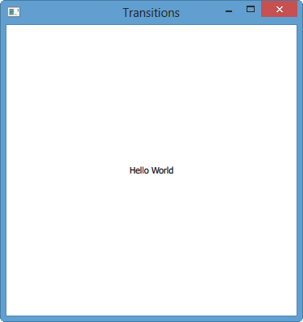

Qt5 Tutorial Creating QtQuick2 QML Animation A
====================================================

Introduction
--------------

In this tutorial, we will learn how to create a Qt Quick2 application.

We're going to use Qt5.1.1 with Qt Creator2.8.1:

Animation Recording

Your browser does not support the video tag.

bogotobogo.com site search:

Creating the Project

Select File &gt; New File or Project &gt; Applications &gt; Qt Quick2
Application &gt; Choose.

Create a project called Transitions.

Qt Creator generates a default QML file that we can modify to create the
main view of the application.

Press Ctrl+R to run the application.

Creating Main View

The main view of the application displays a earth icon in the top left
corner of the screen and two empty rectangles.

To use the **earth.png** image in our application, we must copy it to
the project directory (same subdirectory as the QML file). The image
appears in the Resources pane. We can also use any other image or a QML
element, instead.

In the Projects view, double-click the main.qml file to open it in the
code editor.

Click Design to open the file in Qt Quick Designer:

In the Navigator pane, select Text and press Delete to delete it.

Select Rectangle to edit its properties.

-   In the Id field, enter page, to be able to reference the rectangle
    from other places:
-   In the Colors group, Rectangle field, set the color to #343434:

In the Library view, Resources tab, select **earth.png** and drag and
drop it to the canvas.

-   While we're drag/drop the icon, we need to make the icon as a child
    of page. We can tell the relationship by watching navigator while
    we're moving icon around. If not set properly, we can directly work
    within the Navigator pane.
-   In the Id field, enter icon.
-   In the Position field, set X to 10 and Y to 20.

In the Library view, QML Types, select Rectangle, drag and drop it to
the canvas, and edit its properties.

-   In the Id field, enter topLeftRect.
-   In the Size field, set W and H to 64, for the rectangle size to
    match the image size.
-   In the Colors group, Rectangle field, click the button
    
    to make the rectangle transparent .
-   In the Border field, set the border color to #808080.
-   In the Rectangle group, Border field, set the border width to 1.
-   Note: If the Border field does not appear after you set the border
    color, try setting the border color to solid by clicking the button.
-   In the Radius field, select 6 to create rounded corners for
    the rectangle.

-   Click Layout, and then click the top and left anchor buttons to
    anchor the rectangle to the top left corner of the page.
-   In the Margin field, select 20 for the top anchor and 10 for the
    left anchor.

In the Navigator pane, drag and drop the Mouse Area element from page to
topLeftRect to make it apply only to the rectangle and not to the whole
page.

Edit Mouse Area properties:

-   Click Layout, and then click the button to anchor the mouse area to
    the rectangle.
-   In the code editor, edit the pointer to the clicked expression in
    the mouse area element, as illustrated by the following code
    snippet:
    from:

        MouseArea {
              anchors.fill: parent
              onClicked: {
                  Qt.quit();
              }
        }

    to:

         MouseArea {
             anchors.fill: parent
             onClicked: page.state = ''
         }

    The expression sets the state to the base state and returns the
    image to its initial position.

In the Navigator pane, copy topLeftRect (by pressing Ctrl+C) and paste
it to the canvas twice (by pressing Ctrl+V). Qt Creator renames the new
instances of the element topLeftRect1 and topLeftRect2.

Select topLeftRect1 and edit its properties:

-   In the Id field, enter middleRightRect.
-   In Layout, select the vertical center anchor button and then the
    right anchor button to anchor the rectangle to the middle right
    margin of the screen.
-   In the Margin field, select 10 for the right anchor and 0 for the
    vertical center anchor.
-   In the code editor,add a pointer to a clicked expression to the
    mouse area element. The following expression sets the state to
    State1:

        onClicked: page.state = 'State1'

    You will create State1 later.

Select topLeftRect2 and edit its properties:

In the Id field, enter bottomLeftRect.
In Layout, select the bottom and left anchor buttons to anchor the
rectangle to the bottom left margin of the screen.
In the Margin field, select 20 for the bottom anchor and 10 for the left
anchor.
In the code editor, add a pointer to a clicked expression to the mouse
area element. The following expression sets the state to State2:
    onClicked: page.state = 'State2'

You will create State2 later.

Here is the **main.qml**:

    import QtQuick 2.0

    Rectangle {
        id: page
        width: 360
        height: 360
        color: "#343434"

        Image {
            id: icon
            x: 10
            y: 20
            source: "earth.png"
        }

        Rectangle {
            id: topLeftRect
            width: 64
            height: 64
            color: "#00000000"
            radius: 6
            anchors.left: parent.left
            anchors.leftMargin: 10
            anchors.top: parent.top
            anchors.topMargin: 20
            border.color: "#808080"

            MouseArea {
                anchors.fill: parent
                onClicked: page.state = ''
            }
        }

        Rectangle {
            id: middleRightRect
            x: 6
            y: -6
            width: 64
            height: 64
            color: "#00000000"
            radius: 6
            anchors.right: parent.right
            anchors.rightMargin: 10
            anchors.verticalCenter: parent.verticalCenter
            border.color: "#808080"
            MouseArea {
                anchors.fill: parent
                onClicked: page.state = 'State1'
            }
        }

        Rectangle {
            id: bottomLeftRect
            x: 4
            y: 0
            width: 64
            height: 64
            color: "#00000000"
            radius: 6
            anchors.bottom: parent.bottom
            anchors.bottomMargin: 20
            border.color: "#808080"
            anchors.left: parent.left
            anchors.leftMargin: 10
            MouseArea {
                anchors.fill: parent
                onClicked: page.state = 'State2'
            }
        }
    }

Press Ctrl+S to save the changes.

Press Ctrl+R to run the application.

We should see the Earth in the top left rectangle, and two additional
rectangles in the center right and bottom left of the screen.

We can now create additional states to add views to the application.

This tutorial is based on [Creating a Qt Quick Application](http://qt.developpez.com/doc/qtcreator-2.3/creator-qml-application/).

It seemed straight forward to follow the tutorial at first, however,
there were couple of missing pieces, at least for me. I just hope this
tutorial fills the gap for you if any.

This will be continued, please visit [Creating QML Animation
B](Qt5_Creating_QtQuick2_QML_Application_Animation_B.php):

-   Adding Views
-   Adding Animation to the View
